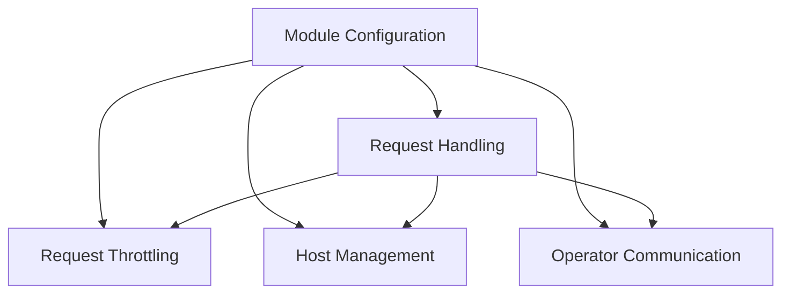

# Resolver Module Documentation

## Introduction

The `resolver` module is a critical component responsible for handling incoming HTTP requests, applying throttling mechanisms, managing host-specific traffic, and communicating with the `operator` module to ensure efficient and reliable service operation. It acts as a reverse proxy, directing requests to appropriate backend services while enforcing various operational policies.

## Architecture Overview

The `resolver` module is structured into several key sub-modules, each with a distinct responsibility. This modular design enhances maintainability, scalability, and clarity of concerns. The primary sub-modules include request handling, throttling, host management, operator communication, and configuration management.

<!-- DIAGRAM_JSON
{
    "direction": "TD",
    "nodes": [
        {"id": "request_handling", "label": "Request Handling", "type": "module", "link": "request_handling.md"},
        {"id": "throttling", "label": "Request Throttling", "type": "module", "link": "throttling.md"},
        {"id": "host_management", "label": "Host Management", "type": "module", "link": "host_management.md"},
        {"id": "operator_communication", "label": "Operator Communication", "type": "module", "link": "operator_communication.md"},
        {"id": "configuration", "label": "Module Configuration", "type": "module", "link": "configuration.md"}
    ],
    "edges": [
        {"source": "configuration", "target": "request_handling"},
        {"source": "configuration", "target": "throttling"},
        {"source": "configuration", "target": "host_management"},
        {"source": "configuration", "target": "operator_communication"},
        {"source": "request_handling", "target": "throttling"},
        {"source": "request_handling", "target": "host_management"},
        {"source": "request_handling", "target": "operator_communication"}
    ],
    "groups": []
}
-->

## Sub-modules

### [Request Handling](request_handling.md)
This sub-module is responsible for processing all incoming HTTP requests, managing the lifecycle of a request from arrival to response, and handling various aspects like buffering and queue status reporting.

### [Request Throttling](throttling.md)
This sub-module implements mechanisms to control the flow of requests, including semaphores and circuit breakers, to prevent system overload and ensure stability under high load.

### [Host Management](host_management.md)
This sub-module focuses on managing the backend hosts, including retrieving host information for routing requests and dynamically enabling or disabling traffic to specific hosts.

### [Operator Communication](operator_communication.md)
This sub-module handles all inter-module communication with the `operator` module, primarily for sending information about incoming requests and potentially receiving operational commands.

### [Module Configuration](configuration.md)
This sub-module defines and consolidates all configurable parameters for the `resolver` module, providing a centralized point for managing operational settings and behaviors.