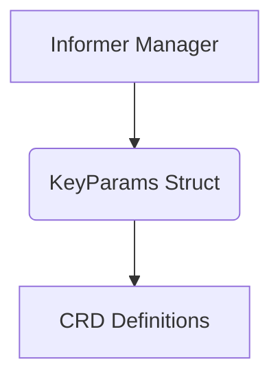

# resource_identification

The `resource_identification` module is a fundamental component within the `informer_manager` module, responsible for defining the structure used to uniquely identify Kubernetes resources. Its primary contribution is the `KeyParams` data structure, which encapsulates essential information needed to pinpoint a specific resource within a Kubernetes cluster.

## Purpose and Core Functionality

The core purpose of the `resource_identification` module is to provide a standardized mechanism for identifying resources. This is achieved through the `KeyParams` struct, which contains the following fields:

*   **Namespace (string):** The Kubernetes namespace where the resource resides.
*   **CRDName (string):** The name of the Custom Resource Definition (CRD) if the resource is a custom resource.
*   **ResourceType (string):** The type of the Kubernetes resource (e.g., "Deployment", "Service", "ElastiService").
*   **ResourceName (string):** The specific name of the resource within its namespace and type.

This structure allows for precise targeting and retrieval of resources, which is crucial for the informer's watch and reconciliation processes.

## Architecture and Component Relationships

The `resource_identification` module, as a leaf module, is primarily composed of the `KeyParams` data structure. It serves as a foundational data model for modules that need to reference Kubernetes resources.

<!-- DIAGRAM_JSON
{
    "direction": "TD",
    "nodes": [
        {"id": "key_params_struct", "label": "KeyParams Struct", "type": "component", "link": null},
        {"id": "informer_manager_module", "label": "Informer Manager", "type": "external", "link": "informer_manager.md"},
        {"id": "crd_definitions_module", "label": "CRD Definitions", "type": "external", "link": "crd_definitions.md"}
    ],
    "edges": [
        {"source": "informer_manager_module", "target": "key_params_struct"},
        {"source": "key_params_struct", "target": "crd_definitions_module"}
    ],
    "groups": []
}
-->

## How the Module Fits into the Overall System

The `resource_identification` module plays a critical role within the broader `operator` system, particularly in how resources are monitored and managed.

*   **Integration with Informer Manager:** The primary consumer of `KeyParams` is the [informer_manager](informer_manager.md) module. The `informer_manager` utilizes `KeyParams` to register watches on specific Kubernetes resources, ensuring that the operator is notified of any changes to these identified resources. This enables efficient and targeted event processing.

*   **Interaction with CRD Definitions:** The `CRDName` and `ResourceType` fields within `KeyParams` directly relate to the [crd_definitions](crd_definitions.md) module. This establishes a clear link between the identification mechanism and the definitions of custom resources within the system, allowing the operator to correctly interpret and manage both built-in and custom Kubernetes resources.