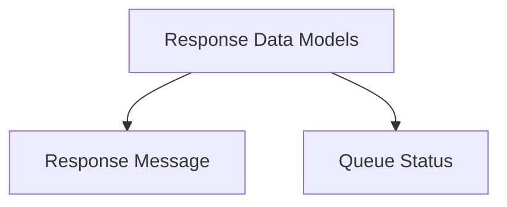

# Response Data Models

## Introduction

The `response_data_models` module defines the data structures used for communication within the `resolver` component, specifically for handling and reporting response information. It encapsulates the formats for standard API responses and internal queue status updates, ensuring consistent data exchange.

## Architecture

This module primarily consists of data model definitions that are utilized by other parts of the resolver's request handling mechanism. The key data models are:

<!-- DIAGRAM_JSON
{
    "direction": "TD",
    "nodes": [
        {"id": "response_data_models", "label": "Response Data Models", "type": "module"},
        {"id": "response_message", "label": "Response Message", "type": "module", "link": "response_message.md"},
        {"id": "queue_status", "label": "Queue Status", "type": "module", "link": "queue_status.md"}
    ],
    "edges": [
        {"source": "response_data_models", "target": "response_message"},
        {"source": "response_data_models", "target": "queue_status"}
    ],
    "groups": []
}
-->

## Sub-modules

### Response Message

This sub-module defines the `Response` struct, which is used for generic API responses. It typically contains a single `Message` field to convey information back to the client or other system components. For more details, refer to the [Response Message documentation](response_message.md).

### Queue Status

The `queue_status` sub-module provides the `QueueStatusResponse` struct, designed to report the current status of an internal processing queue. This is crucial for monitoring the health and performance of asynchronous operations within the resolver. For more details, refer to the [Queue Status documentation](queue_status.md).