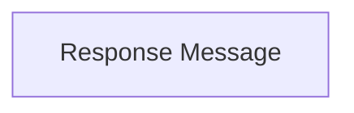

# Response Message

Defines the structure for standard API responses, typically containing a message string.

## Components

This module contains 1 component(s):

- `resolver.internal.handler.handler.Response`

## Structure

---
*This documentation was auto-generated to ensure completeness.*
