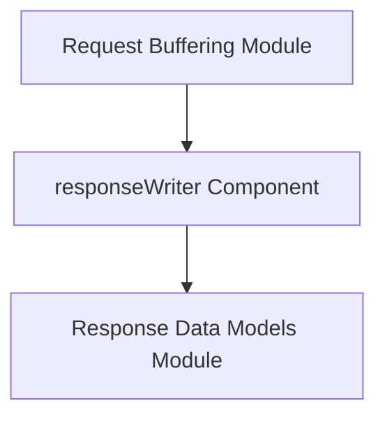

# Module: response_writing

## Introduction

The `response_writing` module is a crucial part of the `resolver` system's `request_handling` sub-system, specifically responsible for managing and writing HTTP responses. It encapsulates the core logic for preparing and sending data back to the client after a request has been processed.

## Core Functionality

This module contains the `responseWriter` component, which extends the standard `http.ResponseWriter` interface. This extension allows the system to intercept, inspect, and potentially modify the HTTP status code and response body before the response is finalized and sent. This capability is essential for implementing features such as:

*   **Response Capturing**: Temporarily holding response data to apply cross-cutting concerns (e.g., logging, metrics, error handling).
*   **Status Code Manipulation**: Overriding or setting specific HTTP status codes based on application logic.
*   **Body Modification**: Injecting headers, modifying content, or compressing the response body.

## Architecture and Component Relationships

The `response_writing` module is a leaf module within the `resolver`'s `internal_request_processing` sub-system. Its primary component, `responseWriter`, works in conjunction with other modules to ensure a robust request-response flow.

<!-- DIAGRAM_JSON
{
    "direction": "TD",
    "nodes": [
        {"id": "response_writer_comp", "label": "responseWriter Component", "type": "component", "link": null},
        {"id": "request_buffering", "label": "Request Buffering Module", "type": "external", "link": "request_buffering.md"},
        {"id": "response_data_models", "label": "Response Data Models Module", "type": "external", "link": "response_data_models.md"}
    ],
    "edges": [
        {"source": "request_buffering", "target": "response_writer_comp"},
        {"source": "response_writer_comp", "target": "response_data_models"}
    ],
    "groups": []
}
-->


### Component Details

#### `resolver.internal.handler.writer.responseWriter`

```go
type responseWriter struct {
	http.ResponseWriter
	statusCode int
	body       []byte
}
```

This struct embeds the standard `http.ResponseWriter`, allowing it to behave like a regular HTTP response writer while providing additional fields (`statusCode` and `body`) to capture the response details. This enables intermediate processing of the response before it's fully committed.

### External Dependencies

*   **`request_buffering`**: This module is responsible for buffering requests. The output from request buffering likely feeds into the processing logic that eventually uses `response_writing` to send a response. For more details, refer to [request_buffering.md](request_buffering.md).
*   **`response_data_models`**: This module defines the data structures for responses, such as `Response` and `QueueStatusResponse`. The `response_writing` module will utilize these models to construct the actual HTTP response payload. For more details, refer to [response_data_models.md](response_data_models.md).

## Integration with Overall System

The `response_writing` module forms the final stage of the request processing pipeline within the `resolver` system's `internal_request_processing` component. After a request has been handled and the necessary data generated, `response_writing` takes over to format this data into an HTTP response and transmit it back to the client. It ensures that all responses adhere to the expected structure and can be subject to any necessary post-processing.
