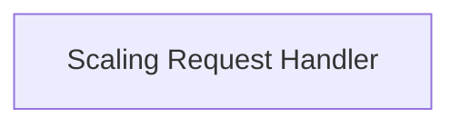

# Scaling Request Handler

Manages the execution of scaling operations by interacting with the Kubernetes API.

## Components

This module contains 1 component(s):

- `pkg.scaling.scale_handler.ScaleHandler`

## Structure

---
*This documentation was auto-generated to ensure completeness.*
