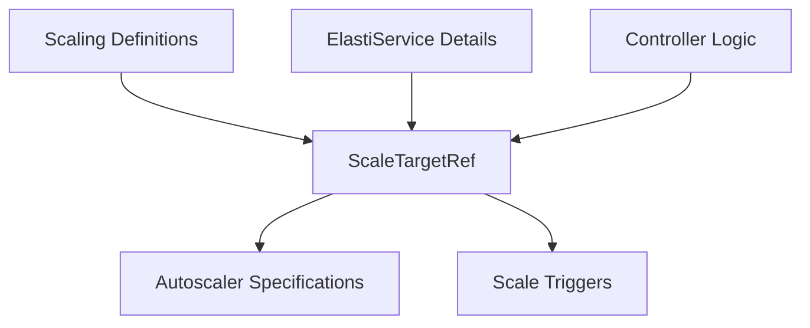

# Scale Target Reference Module

The `scale_target_reference` module defines the `ScaleTargetRef` structure, a fundamental building block for specifying the target resources that an autoscaler or scaling mechanism should manage within the ElastiService ecosystem.

## Purpose and Core Functionality

The primary purpose of this module is to provide a standardized and consistent way to identify Kubernetes resources that are subject to scaling operations. The `ScaleTargetRef` object acts as a pointer to a specific resource (e.g., Deployment, Rollout) by encapsulating its API version, kind, and name. This abstraction allows the ElastiService operator to interact with various types of scalable workloads uniformly.

### Core Component: `ScaleTargetRef`

```go
type ScaleTargetRef struct {
	// API version of the target resource
	// +kubebuilder:validation:Enum=apps/v1;argoproj.io/v1alpha1
	APIVersion string `json:"apiVersion"`
	// Kind of the target resource
	// +kubebuilder:validation:Enum=deployments;rollouts;Deployment;StatefulSet;Rollout
	Kind string `json:"kind"`
	// Name of the target resource
	Name string `json:"name"`
}
```

*   **`APIVersion`**: Specifies the API group and version of the target Kubernetes resource (e.g., `apps/v1`, `argoproj.io/v1alpha1`). This ensures compatibility and correct API interaction.
*   **`Kind`**: Identifies the type of the target Kubernetes resource (e.g., `Deployment`, `Rollout`, `StatefulSet`). This helps in determining which Kubernetes API objects to query or manipulate.
*   **`Name`**: The specific name of the target resource within its namespace. This uniquely identifies the resource to be scaled.

## Architecture and Component Relationships

The `ScaleTargetRef` is a crucial data structure within the `operator.api.v1alpha1.elastiservice_types` package, which defines the Custom Resource Definitions (CRDs) for ElastiService. It is typically embedded within other CRD specifications, such as the `AutoscalerSpec`, to indicate which resource an autoscaler should manage.

### Relationships:

*   **[scaling_definitions.md](scaling_definitions.md)**: The parent module that groups all scaling-related CRD definitions, including `ScaleTargetRef`.
*   **[autoscaler_specifications.md](autoscaler_specifications.md)**: The `AutoscalerSpec` CRD heavily relies on `ScaleTargetRef` to specify the workload it needs to scale.
*   **[scale_triggers.md](scale_triggers.md)**: While not directly containing `ScaleTargetRef`, scaling triggers would ultimately operate on the resources identified by a `ScaleTargetRef` through the autoscaler.
*   **[elastiservice_details.md](elastiservice_details.md)**: The `ElastiServiceSpec` (defined in this module) likely contains the `AutoscalerSpec`, thus indirectly incorporating `ScaleTargetRef` to define the overall scaling behavior of an ElastiService.
*   **[controller_logic.md](controller_logic.md)**: The `ElastiServiceReconciler` within the controller logic module reads and interprets `ScaleTargetRef` objects from ElastiService CRs to identify and interact with the actual Kubernetes resources to be scaled.

<!-- DIAGRAM_JSON
{
    "direction": "TD",
    "nodes": [
        {"id": "scale_target_ref_component", "label": "ScaleTargetRef", "type": "component", "link": null},
        {"id": "scaling_definitions", "label": "Scaling Definitions", "type": "external", "link": "scaling_definitions.md"},
        {"id": "autoscaler_specifications", "label": "Autoscaler Specifications", "type": "external", "link": "autoscaler_specifications.md"},
        {"id": "scale_triggers", "label": "Scale Triggers", "type": "external", "link": "scale_triggers.md"},
        {"id": "elastiservice_details", "label": "ElastiService Details", "type": "external", "link": "elastiservice_details.md"},
        {"id": "controller_logic", "label": "Controller Logic", "type": "external", "link": "controller_logic.md"}
    ],
    "edges": [
        {"source": "scaling_definitions", "target": "scale_target_ref_component"},
        {"source": "scale_target_ref_component", "target": "autoscaler_specifications"},
        {"source": "scale_target_ref_component", "target": "scale_triggers"},
        {"source": "elastiservice_details", "target": "scale_target_ref_component"},
        {"source": "controller_logic", "target": "scale_target_ref_component"}
    ],
    "groups": []
}
-->



## How the module fits into the overall system

This `scale_target_reference` module, through its `ScaleTargetRef` structure, is integral to the declarative management of scalable workloads by the ElastiService operator. It provides the concrete mechanism for users to specify which Kubernetes resources their `ElastiService` CRD should target for autoscaling. Without this definition, the operator would lack the necessary information to identify and interact with the underlying deployments, rollouts, or stateful sets, making dynamic scaling impossible. It forms a critical link between the abstract autoscaling policies defined in the `ElastiServiceSpec` and the actual operational resources within a Kubernetes cluster.