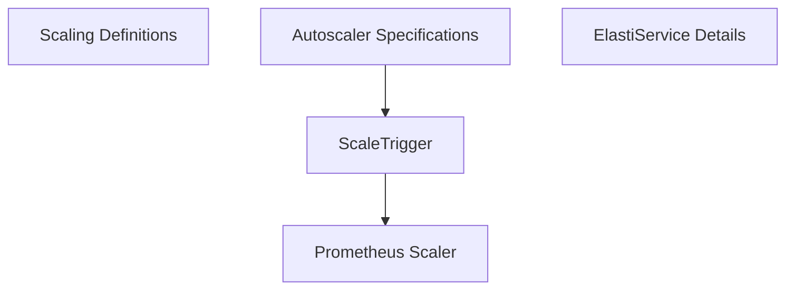

# scale_triggers

The `scale_triggers` module defines the `ScaleTrigger` custom resource definition (CRD) type, which is a fundamental component for specifying how an `ElastiService` should automatically scale based on various metrics or conditions. This module ensures that the operator can understand and interpret the desired scaling behavior for managed services.

## Core Functionality

The primary functionality of this module revolves around the `ScaleTrigger` struct:

- **Defining Scaling Conditions:** `ScaleTrigger` allows users to specify the type of scaling trigger (e.g., `prometheus`) and provide associated metadata for that trigger.
- **Extensibility:** While currently supporting `prometheus`, the design allows for future expansion to include other trigger types.
- **Configuration Storage:** It serves as a structured way to store trigger-specific configuration details as raw JSON.

## Architecture and Component Relationships

The `scale_triggers` module is a leaf module within the `operator`'s CRD definitions, specifically part of the `scaling_definitions`. It defines a critical element (`ScaleTrigger`) that is utilized by other CRDs to configure autoscaling.

<!-- DIAGRAM_JSON
{
    "direction": "TD",
    "nodes": [
        {"id": "scale_trigger", "label": "ScaleTrigger", "type": "component", "link": null},
        {"id": "scaling_definitions", "label": "Scaling Definitions", "type": "external", "link": "scaling_definitions.md"},
        {"id": "autoscaler_specifications", "label": "Autoscaler Specifications", "type": "external", "link": "autoscaler_specifications.md"},
        {"id": "elastiservice_details", "label": "ElastiService Details", "type": "external", "link": "elastiservice_details.md"},
        {"id": "prometheus_scaler", "label": "Prometheus Scaler", "type": "external", "link": "prometheus_scaler.md"}
    ],
    "edges": [
        {"source": "autoscaler_specifications", "target": "scale_trigger"},
        {"source": "scale_trigger", "target": "prometheus_scaler"}
    ],
    "groups": []
}
-->

### Component Breakdown

*   **`ScaleTrigger`**: (Core component) This Go struct defines the schema for a scaling trigger. It includes fields for `Type` (e.g., `prometheus`) and `Metadata` (raw JSON containing trigger-specific configuration like query, server address, threshold, etc.).

### External Dependencies

*   **`scaling_definitions`**: This parent module groups various scaling-related CRD definitions, including `ScaleTrigger`.
*   **`autoscaler_specifications`**: The `AutoscalerSpec` defined in this module likely incorporates `ScaleTrigger` to specify the actual scaling policy for an `ElastiService`.
*   **`elastiservice_details`**: The `ElastiServiceSpec` (defined within `elastiservice_details`) contains the overall specification for an ElastiService, which includes the `AutoscalerSpec` and, by extension, `ScaleTrigger`.
*   **`prometheus_scaler`**: When the `ScaleTrigger` type is `prometheus`, the `prometheus_scaler` module (from the `pkg.scaling.scalers` package) is responsible for interpreting the `Metadata` and executing the actual scaling logic based on Prometheus metrics.

## System Integration

The `scale_triggers` module plays a crucial role in the overall `operator` system by providing the definition for how services should scale.

-   **CRD Definition**: It serves as a part of the Kubernetes Custom Resource Definitions, allowing users to define scaling policies directly within their `ElastiService` manifests.
-   **Operator Reconciliation**: The `operator.internal.controller.elastiservice_controller.ElastiServiceReconciler` (from `controller_logic`) uses this definition to understand the desired scaling state and ensures that the actual state of the `ElastiService` aligns with the specified `ScaleTrigger`.
-   **Dynamic Scaling**: By integrating with external scalers like `prometheus_scaler`, this module enables dynamic scaling of services based on real-time metrics, enhancing the elasticity and efficiency of managed applications.