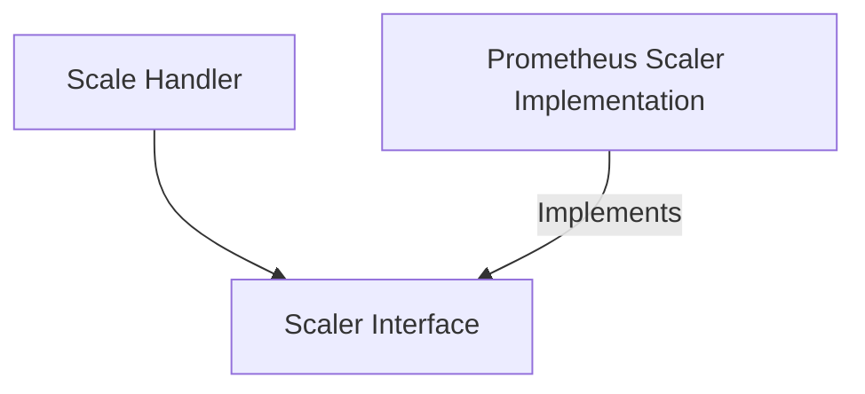

# Scaler Interface Module

## Introduction

The `scaler_interface` module defines the core `Scaler` interface, which establishes a contract for different scaling mechanisms within the system. This module is crucial for maintaining a flexible and extensible architecture, allowing various scaling strategies to be implemented and integrated uniformly without affecting the higher-level scaling logic.

## Architecture and Component Relationships

This module primarily consists of a single Go interface, `Scaler`, which outlines the essential operations that any scaling implementation must provide.

### Core Component: `Scaler`

```go
type Scaler interface {
	IsHealthy(ctx context.Context) (bool, error)
	ShouldScaleToZero(ctx context.Context) (bool, error)
	ShouldScaleFromZero(ctx context.Context) (bool, error)
	Close(ctx context.Context) error
}
```

- **`IsHealthy(ctx context.Context) (bool, error)`**: This method is responsible for checking the operational health of the scaler implementation. It returns `true` if the scaler is healthy and ready to perform scaling operations, along with any error encountered during the health check.
- **`ShouldScaleToZero(ctx context.Context) (bool, error)`**: This method determines whether a particular service or workload should be scaled down to zero instances. It returns `true` if scaling to zero is recommended based on the scaler's logic, and an error if the determination fails.
- **`ShouldScaleFromZero(ctx context.Context) (bool, error)`**: Conversely, this method decides if a service that is currently at zero instances should be scaled up. It returns `true` if scaling up from zero is necessary, along with any associated error.
- **`Close(ctx context.Context) error`**: This method is used to perform any necessary cleanup or resource release when the scaler is no longer needed. It ensures proper shutdown and prevents resource leaks.

## How it Fits into the Overall System

The `scaler_interface` module serves as an abstraction layer within the `pkg.scaling` module. By defining a common interface, it decouples the core scaling orchestration logic from specific scaler implementations. This design allows for:

- **Pluggable Scaling Strategies**: New scaling mechanisms (e.g., based on different metrics sources or algorithms) can be added by simply implementing the `Scaler` interface without modifying existing code that uses the interface.
- **Simplified Integration**: Components like the `ScaleHandler` ([scale_handler.md](scale_handler.md)) can interact with any concrete scaler implementation through this unified interface, promoting cleaner code and easier maintenance.
- **Testability**: Individual scaler implementations can be tested in isolation against the `Scaler` contract.

For example, the `prometheus_implementation` ([prometheus_implementation.md](prometheus_implementation.md)) module provides a concrete implementation of the `Scaler` interface using Prometheus metrics.

<!-- DIAGRAM_JSON
{
    "direction": "TD",
    "nodes": [
        {"id": "scaler_interface", "label": "Scaler Interface", "type": "component", "link": null},
        {"id": "scale_handler", "label": "Scale Handler", "type": "external", "link": "scale_handler.md"},
        {"id": "prometheus_implementation", "label": "Prometheus Scaler Implementation", "type": "external", "link": "prometheus_implementation.md"}
    ],
    "edges": [
        {"source": "scale_handler", "target": "scaler_interface"},
        {"source": "prometheus_implementation", "target": "scaler_interface", "label": "Implements"}
    ],
    "groups": []
}
-->


