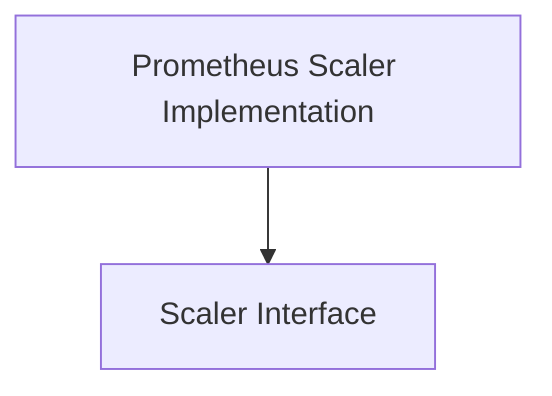

# Scalers Module Documentation

## Introduction
The `scalers` module, part of `pkg.scaling`, defines and implements various scaling mechanisms within the system. It provides the core abstractions for determining when and how to scale resources based on metrics and other criteria. This module is crucial for the dynamic adjustment of resources, enabling efficient handling of varying workloads.

## Architecture Overview
The `scalers` module is designed to be extensible, allowing for different types of scalers to be integrated. At its core is a generic `Scaler` interface that all concrete scaler implementations must adhere to. This module currently includes an implementation for Prometheus-based scaling.

<!-- DIAGRAM_JSON
{
    "direction": "TD",
    "nodes": [
        {"id": "scaler_interface", "label": "Scaler Interface", "type": "module", "link": "scaler_interface.md"},
        {"id": "prometheus_implementation", "label": "Prometheus Scaler Implementation", "type": "module", "link": "prometheus_implementation.md"}
    ],
    "edges": [
        {"source": "prometheus_implementation", "target": "scaler_interface"}
    ],
    "groups": []
}
-->

## High-level Functionality

*   **[Scaler Interface](scaler_interface.md)**: This sub-module defines the `Scaler` interface, which outlines the fundamental operations required for any scaling mechanism, such as checking health and determining scale-to-zero or scale-from-zero conditions. It serves as a contract for all scaler implementations.

*   **[Prometheus Scaler Implementation](prometheus_implementation.md)**: This sub-module provides a concrete implementation of the `Scaler` interface, leveraging Prometheus metrics to make dynamic scaling decisions based on configured queries and thresholds. It includes components for managing Prometheus-specific metadata and handling HTTP requests to the Prometheus server.
