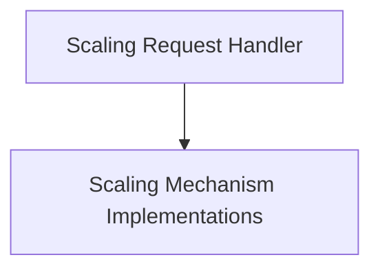

# Scaling Module Documentation

## Introduction

The `scaling` module is responsible for managing the automatic scaling of services within the system. It provides the core logic and components for handling scaling requests, implementing various scaling mechanisms, and interacting with the underlying infrastructure (e.g., Kubernetes) to adjust resource allocations.

## Architecture

The `scaling` module is composed of two main sub-modules: `scale_handler` and `scalers`. The `scale_handler` module orchestrates the scaling process, while the `scalers` module provides specific implementations for different scaling metrics and platforms.

<!-- DIAGRAM_JSON
{
    "direction": "TD",
    "nodes": [
        {"id": "scale_handler", "label": "Scaling Request Handler", "type": "module", "link": "scale_handler.md"},
        {"id": "scalers", "label": "Scaling Mechanism Implementations", "type": "module", "link": "scalers.md"}
    ],
    "edges": [
        {"source": "scale_handler", "target": "scalers"}
    ],
    "groups": []
}
-->

## Sub-modules

### [Scale Handler](scale_handler.md)
This sub-module (`scale_handler`) is responsible for managing and orchestrating scaling operations. It interacts with the Kubernetes API to adjust resource allocations and handles concurrency for scaling requests.

### [Scalers](scalers.md)
This sub-module (`scalers`) provides the core interfaces and implementations for different scaling mechanisms. It includes components for Prometheus-based scaling, defining how metrics are collected and evaluated to determine scaling actions.
