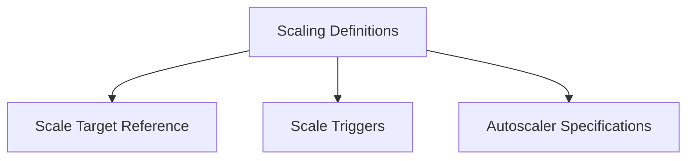

# Scaling Definitions Module

## Introduction

The `scaling_definitions` module is a crucial part of the operator's API, responsible for defining the core parameters for resource scaling within the Kubernetes environment. It encapsulates the necessary information to identify target resources for scaling, specify the triggers that initiate scaling actions, and determine the type of autoscaler to be utilized. This module provides the foundational data structures that enable dynamic and automated scaling of services managed by the operator.

## Architecture Overview

The `scaling_definitions` module is composed of three primary components, each handling a distinct aspect of scaling configuration:

*   **Scale Target Reference**: Identifies the specific Kubernetes resource (e.g., Deployment, Rollout) that needs to be scaled.
*   **Scale Triggers**: Defines the criteria (e.g., Prometheus metrics) that will cause a scaling event to occur.
*   **Autoscaler Specifications**: Determines which autoscaling mechanism (e.g., HPA, KEDA) will manage the scaling operations.

These components work in conjunction to provide a comprehensive definition for how a service should be scaled within the operator framework.

<!-- DIAGRAM_JSON
{
    "direction": "TD",
    "nodes": [
        {"id": "scale_target_reference", "label": "Scale Target Reference", "type": "module", "link": "scale_target_reference.md"},
        {"id": "scale_triggers", "label": "Scale Triggers", "type": "module", "link": "scale_triggers.md"},
        {"id": "autoscaler_specifications", "label": "Autoscaler Specifications", "type": "module", "link": "autoscaler_specifications.md"}
    ],
    "edges": [
        {"source": "scaling_definitions", "target": "scale_target_reference"},
        {"source": "scaling_definitions", "target": "scale_triggers"},
        {"source": "scaling_definitions", "target": "autoscaler_specifications"}
    ],
    "groups": []
}
-->

## Sub-modules

This module is further broken down into the following sub-modules:

### Scale Target Reference

This sub-module, documented in [scale_target_reference.md](scale_target_reference.md), defines the `ScaleTargetRef` structure. It is used to specify the API version, kind, and name of the Kubernetes resource that the operator should target for scaling operations.

### Scale Triggers

The [scale_triggers.md](scale_triggers.md) sub-module focuses on the `ScaleTrigger` structure. It details how scaling events are initiated, including the type of trigger (e.g., Prometheus) and any associated metadata required for evaluating the trigger condition.

### Autoscaler Specifications

Detailed in [autoscaler_specifications.md](autoscaler_specifications.md), this sub-module defines the `AutoscalerSpec`. It specifies the particular autoscaling mechanism, such as Kubernetes Horizontal Pod Autoscaler (HPA) or KEDA, that will be responsible for executing the scaling logic based on the defined triggers and targets.