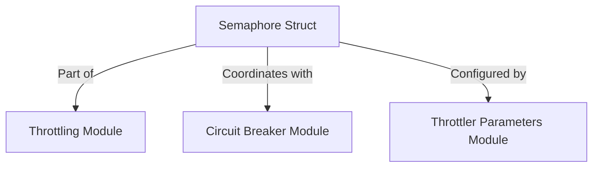

# Semaphore Mechanism Module

## Introduction

The `semaphore_mechanism` module, located at `resolver/internal/throttler/semaphore.go`, provides a fundamental concurrency control mechanism within the `resolver` system. It implements a semaphore to limit the number of simultaneous operations or requests, thereby preventing resource exhaustion and ensuring system stability under heavy load. This module is a core component of the `throttling` system, working in conjunction with circuit breakers and throttler parameters to manage request flow effectively.

## Architecture and Component Relationships

The `semaphore_mechanism` module primarily exposes the `semaphore` struct, which encapsulates the state and queuing logic required for managing concurrent access. It forms an integral part of the broader `throttling` module, collaborating with other throttling components to provide a robust request management system.

<!-- DIAGRAM_JSON
{
    "direction": "TD",
    "nodes": [
        {"id": "semaphore_struct", "label": "Semaphore Struct", "type": "component", "link": null},
        {"id": "throttling", "label": "Throttling Module", "type": "external", "link": "throttling.md"},
        {"id": "circuit_breaker", "label": "Circuit Breaker Module", "type": "external", "link": "circuit_breaker.md"},
        {"id": "throttler_parameters", "label": "Throttler Parameters Module", "type": "external", "link": "throttler_parameters.md"}
    ],
    "edges": [
        {"source": "semaphore_struct", "target": "throttling", "label": "Part of"},
        {"source": "semaphore_struct", "target": "circuit_breaker", "label": "Coordinates with"},
        {"source": "semaphore_struct", "target": "throttler_parameters", "label": "Configured by"}
    ],
    "groups": []
}
-->


### Core Components

#### `semaphore` Struct

**Component ID**: `resolver.internal.throttler.semaphore.semaphore`

The `semaphore` struct is the central component of this module, responsible for implementing the semaphore logic. It manages the available permits and handles the queuing of requests when no permits are available.

```go
type semaphore struct {
	state atomic.Uint64
	queue chan struct{}
}
```

*   `state atomic.Uint64`: An atomic unsigned 64-bit integer that represents the current state of the semaphore, typically the number of available permits. Using `atomic.Uint64` ensures thread-safe operations on the permit count, preventing race conditions in a concurrent environment.
*   `queue chan struct{}`: A channel used for goroutines to wait when attempting to acquire a permit when none are available. Goroutines block on this channel until a permit is released, at which point one waiting goroutine is unblocked.

### How the Module Fits into the Overall System

The `semaphore_mechanism` module is a vital part of the `resolver`'s `throttling` subsystem. It provides the low-level concurrency control necessary to enforce limits on resource usage. By integrating with the broader `throttling` strategy, including components like the [circuit_breaker module](circuit_breaker.md) and [throttler_parameters module](throttler_parameters.md), it helps the `resolver` maintain high availability and responsiveness by preventing overload and cascading failures. This module ensures that the `resolver` can gracefully handle spikes in request traffic and operate reliably under varying load conditions. For more details on the overall throttling strategy, refer to the [throttling module documentation](throttling.md).