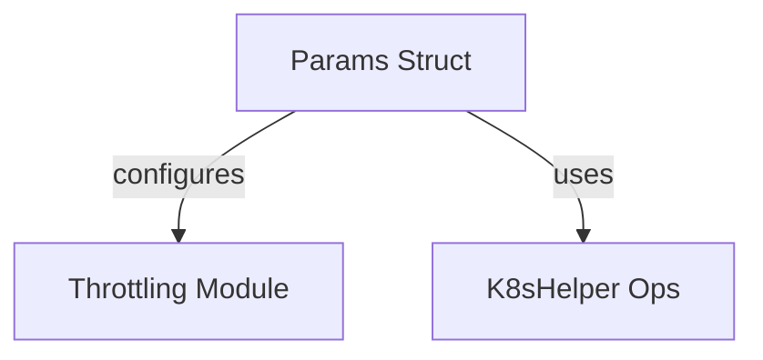

# Module: `throttler_parameters`

## Introduction
The `throttler_parameters` module is a sub-module of the `throttling` module within the `resolver` component. It primarily defines the `Params` struct, which encapsulates various configuration parameters essential for the operation of the system's throttling mechanisms. These parameters govern aspects like retry durations, concurrency limits, and queue depths, ensuring controlled resource utilization and stable system performance.

## Purpose and Core Functionality
The main purpose of the `throttler_parameters` module is to provide a centralized and structured way to configure the behavior of the `Throttler` component. By defining the `Params` struct, it allows for easy modification and management of critical throttling settings without directly altering the core throttling logic.

The `Params` struct includes:
*   `QueueRetryDuration`: Specifies the duration to wait before retrying a queued request.
*   `TrafficReEnableDuration`: Defines the duration after which traffic can be re-enabled following a circuit breaker trip or similar event.
*   `K8sUtil`: A utility object for interacting with Kubernetes, likely used for dynamic configuration or status updates related to throttling. (Refer to [pkg.md](pkg.md) for more details on `K8sUtil`).
*   `QueueDepth`: The maximum number of requests that can be held in a queue.
*   `MaxConcurrency`: The maximum number of concurrent requests allowed.
*   `InitialCapacity`: The initial capacity for certain throttling mechanisms (e.g., semaphores).
*   `Logger`: An instance for logging, enabling detailed insights into the throttler's operations.

## Architecture and Component Relationships

<!-- DIAGRAM_JSON
{
    "direction": "TD",
    "nodes": [
        {"id": "params", "label": "Params Struct", "type": "component", "link": null},
        {"id": "throttler_module", "label": "Throttling Module", "type": "external", "link": "throttling.md"},
        {"id": "k8s_helper_ops", "label": "K8sHelper Ops", "type": "external", "link": "pkg.md"}
    ],
    "edges": [
        {"source": "params", "target": "throttler_module", "label": "configures"},
        {"source": "params", "target": "k8s_helper_ops", "label": "uses"}
    ],
    "groups": []
}
-->

### Component Breakdown

*   **`Params` (Internal Component)**:
    *   This is the core component of this module, defining the structure for all throttling-related configuration parameters.
    *   It is instantiated and populated with values that dictate the behavior of the `Throttler`.

*   **`Throttling Module` (External Dependency)**:
    *   The `throttling` module (specifically, the `Throttler` component within it) consumes the `Params` struct to initialize its internal state and configure its operations.
    *   Refer to [throttling.md](throttling.md) for detailed information on the `throttling` module and its functionalities.

*   **`K8sHelper Ops` (External Dependency)**:
    *   The `Params` struct references `k8shelper.Ops`, indicating a dependency on Kubernetes utility functions. This allows the throttler to potentially interact with the Kubernetes API for dynamic scaling information or resource management.
    *   More information on `k8shelper.Ops` can be found in [pkg.md](pkg.md).

## How the Module Fits into the Overall System
The `throttler_parameters` module plays a foundational role in the `resolver`'s `throttling` subsystem. By centralizing the configuration of throttling parameters, it ensures that the `Throttler` operates with consistent and well-defined rules across the system. This modular approach enhances maintainability, allowing developers to easily adjust throttling behavior without altering the implementation logic of the `Throttler` itself. It acts as the blueprint for how the system's resources are managed under varying load conditions, contributing to the overall stability and responsiveness of the `resolver` service.
