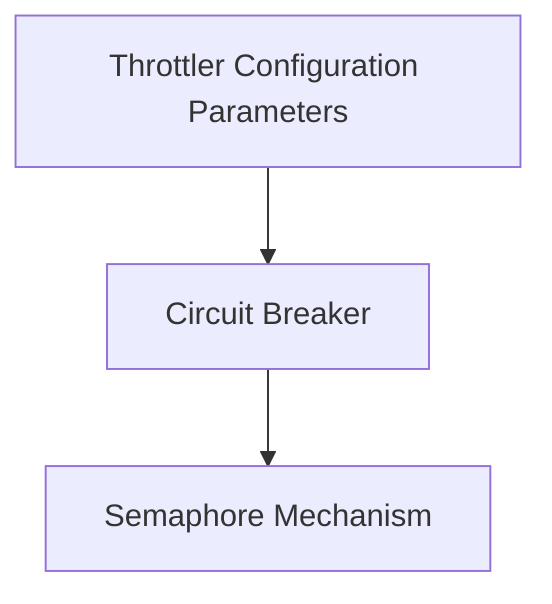

# Throttling Module

## Introduction

The `throttling` module is responsible for controlling resource access and preventing system overload within the resolver. It implements various mechanisms such as semaphores and circuit breakers to manage concurrency, limit request rates, and protect downstream services from excessive load. This ensures the stability and reliability of the system under varying traffic conditions.

## Architecture Overview

The `throttling` module is composed of several key components that work together to enforce traffic policies. At its core, it leverages a `semaphore` for basic concurrency control. This `semaphore` is then integrated into a `circuit breaker` pattern, which dynamically opens and closes circuits to protect services from sustained failures or overloads. The overall `Throttler` (whose configuration is defined by `throttler_parameters`) orchestrates these mechanisms, adjusting behavior based on system health and predefined policies.

<!-- DIAGRAM_JSON
{
    "direction": "TD",
    "nodes": [
        {"id": "circuit_breaker", "label": "Circuit Breaker", "type": "module", "link": "circuit_breaker.md"},
        {"id": "semaphore_mechanism", "label": "Semaphore Mechanism", "type": "module", "link": "semaphore_mechanism.md"},
        {"id": "throttler_parameters", "label": "Throttler Configuration Parameters", "type": "module", "link": "throttler_parameters.md"}
    ],
    "edges": [
        {"source": "circuit_breaker", "target": "semaphore_mechanism"},
        {"source": "throttler_parameters", "target": "circuit_breaker"}
    ],
    "groups": []
}
-->

## Sub-modules

### [Circuit Breaker](circuit_breaker.md)
This sub-module provides a robust circuit breaker implementation to protect services from cascading failures. It monitors the health of upstream services and can temporarily stop traffic to unhealthy ones, allowing them to recover.

### [Semaphore Mechanism](semaphore_mechanism.md)
The semaphore mechanism is a fundamental component for controlling the number of concurrent operations. It ensures that a specified maximum number of requests or processes can access a shared resource at any given time, preventing resource exhaustion.

### [Throttler Configuration Parameters](throttler_parameters.md)
This sub-module defines the crucial parameters and settings that govern the behavior of the overall Throttler, including retry durations for queued requests, maximum concurrency limits, and initial capacities.

## External Dependencies

The `throttling` module, particularly through its main `Throttler` structure (configured by `throttler_parameters`), interacts with Kubernetes utilities. Specifically, it uses `k8shelper.Ops` from the `pkg` module for Kubernetes-related operations. Refer to the [pkg documentation](pkg.md) for more details on `k8shelper.Ops` and other utility components.
