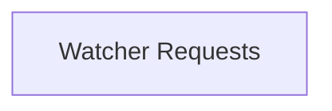

# Watcher Requests

Defines the structure for requests to watch Kubernetes resources, including resource details and event handlers.

## Components

This module contains 1 component(s):

- `operator.internal.informer.informer.RequestWatch`

## Structure

---
*This documentation was auto-generated to ensure completeness.*
