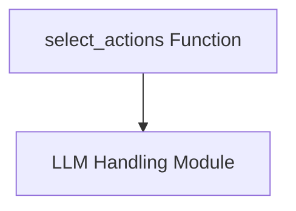

# action_selection Module Documentation

## Introduction

The `action_selection` module is a crucial part of the web navigation agent, primarily responsible for intelligently filtering a set of candidate actions. Given the user's intent, the agent's history, and the current state of the webpage, this module leverages a large language model (LLM) to identify and select actions that are most likely to contribute to the successful completion of the user's task. This filtering process ensures that the agent focuses on relevant actions, optimizing its navigation strategy.

## Architecture and Component Relationships

The `action_selection` module contains the core logic for selecting actions. Its primary component, `select_actions`, interacts with an external LLM handling mechanism to perform its filtering task.

<!-- DIAGRAM_JSON
{
    "direction": "TD",
    "nodes": [
        {"id": "select_actions", "label": "select_actions Function", "type": "component", "link": null},
        {"id": "llm_handling", "label": "LLM Handling Module", "type": "external", "link": "llm_handling.md"}
    ],
    "edges": [
        {"source": "select_actions", "target": "llm_handling"}
    ],
    "groups": []
}
-->

### Core Components

#### `select_actions`

The `select_actions` function is the central piece of this module. It takes various contextual inputs such as screenshots of the webpage, past actions, the user's intent, and a list of proposed actions. It then constructs a detailed prompt, including a system message that guides the LLM on its role – to filter out irrelevant actions rather than pick a single "best" one immediately.

**Key responsibilities of `select_actions`:**

*   **Contextual Prompt Generation**: Gathers all relevant information (screenshots, intent, action history, current URL, candidate actions) and formats it into a comprehensive prompt suitable for a multi-modal LLM.
*   **LLM Interaction**: Communicates with an external LLM (e.g., GPT-4o) to receive a thoughtful evaluation of the candidate actions.
*   **Response Parsing**: Extracts the selected action identifiers from the LLM's response.

**Dependencies**:
This function relies heavily on the capabilities provided by the [llm_handling module](llm_handling.md) for interacting with large language models.

## How the Module Fits into the Overall System

The `action_selection` module is a vital part of the agent's decision-making process within the broader `simulation_and_control` system. It acts as a crucial filtering layer before actions are potentially simulated or executed. By narrowing down the pool of possible actions to only those deemed relevant by an intelligent model, it significantly improves the efficiency and accuracy of the subsequent steps, such as single-action simulation and success evaluation (covered in the [simulation_scoring module](simulation_scoring.md)).

It ensures that the agent's trajectory is guided by a curated set of potentially fruitful actions, preventing the agent from pursuing clearly unhelpful paths and thereby enhancing the overall task completion rate.