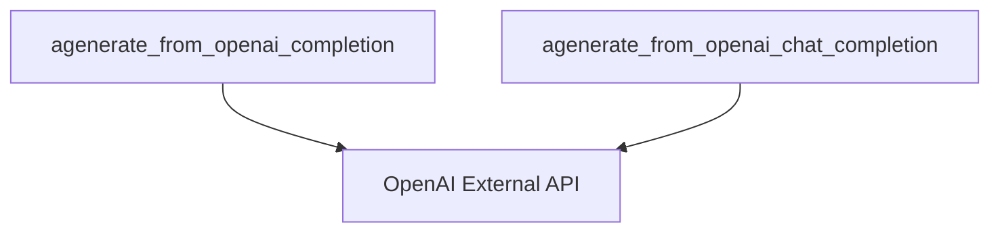

# api_interaction Module Documentation

The `api_interaction` module is a leaf module within the `llm_handling` component, specifically nested under `openai_integrations`. Its primary role is to encapsulate the asynchronous communication with the OpenAI API for both completion and chat-based models.

## Purpose and Core Functionality

This module provides the fundamental capabilities for sending prompts to OpenAI's language models and retrieving their generated responses. It abstracts away the direct API calls, incorporating features like rate limiting and error handling (specifically, raising an error if `OPENAI_API_KEY` is not set).

*   `agenerate_from_openai_completion`: Handles asynchronous requests to the OpenAI Completion API, processing a list of prompts concurrently.
*   `agenerate_from_openai_chat_completion`: Manages asynchronous requests to the OpenAI Chat Completion API, designed for conversational interactions with message lists.

## Architecture and Component Relationships

<!-- DIAGRAM_JSON
{
    "direction": "TD",
    "nodes": [
        {"id": "agenerate_from_openai_completion_node", "label": "agenerate_from_openai_completion", "type": "component", "link": null},
        {"id": "agenerate_from_openai_chat_completion_node", "label": "agenerate_from_openai_chat_completion", "type": "component", "link": null},
        {"id": "openai_external_api", "label": "OpenAI External API", "type": "external", "link": null}
    ],
    "edges": [
        {"source": "agenerate_from_openai_completion_node", "target": "openai_external_api"},
        {"source": "agenerate_from_openai_chat_completion_node", "target": "openai_external_api"}
    ],
    "groups": []
}
-->

The `api_interaction` module is a collection of two core asynchronous functions:

*   `agenerate_from_openai_completion`: This function is responsible for making requests to OpenAI's legacy Completion API endpoint. It takes a list of prompts and returns the generated text responses. It utilizes `aiolimiter` for rate limiting to respect API usage policies and `tqdm_asyncio` for concurrent execution and progress tracking.
*   `agenerate_from_openai_chat_completion`: Similar to the completion function, this handles requests to the newer OpenAI Chat Completion API. It accepts a list of message lists (representing conversational turns) and extracts the model's content response. It also integrates `aiolimiter` and `tqdm_asyncio` for efficient and controlled API access.

Both functions share common responsibilities such as checking for the `OPENAI_API_KEY` environment variable and orchestrating asynchronous API calls.

## How the module fits into the overall system

The `api_interaction` module serves as the lowest-level interface for interacting with the OpenAI platform. It is a critical sub-module of the [openai_integrations.md](openai_integrations.md) module, which further abstracts and standardizes the interactions with various OpenAI models. The `openai_integrations` module, in turn, is a part of the broader [llm_handling.md](llm_handling.md) component, responsible for managing all aspects of Language Model operations within the system, including configuration and unified calling mechanisms.

By centralizing the direct API calls and rate limiting within `api_interaction`, the system ensures consistent and robust communication with OpenAI, allowing higher-level modules to focus on prompt engineering, response parsing, and overall LLM orchestration without concern for the underlying API mechanics.
