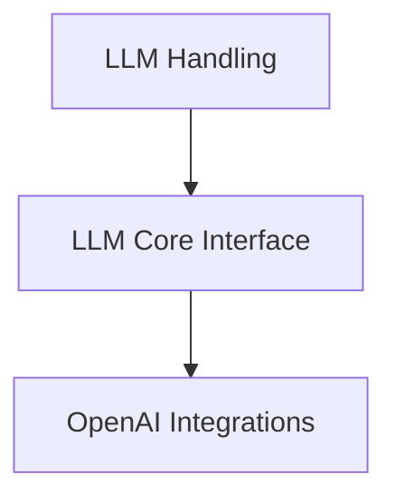

# LLM Core Interface

## Introduction
The `llm_core_interface` module provides a unified and abstract interface for interacting with various Large Language Models (LLMs). It centralizes the logic for configuring LLM parameters and dispatching requests to different providers, simplifying LLM integration across the entire system. This module aims to abstract away the complexities of different LLM APIs, offering a consistent way to prepare configurations and invoke models.

## Architecture Overview
The `llm_core_interface` acts as an intermediary, taking configuration parameters and user prompts to interact with underlying LLM provider APIs. It integrates closely with its parent module, [llm_handling.md](llm_handling.md), and depends on provider-specific integration modules, such as [openai_integrations.md](openai_integrations.md), to execute actual API calls. This modular design ensures flexibility and extensibility for supporting new LLM providers.

<!-- DIAGRAM_JSON
{
    "direction": "TD",
    "nodes": [
        {"id": "llm_core_interface", "label": "LLM Core Interface", "type": "module", "link": "llm_core_interface.md"},
        {"id": "llm_handling", "label": "LLM Handling", "type": "module", "link": "llm_handling.md"},
        {"id": "openai_integrations", "label": "OpenAI Integrations", "type": "module", "link": "openai_integrations.md"}
    ],
    "edges": [
        {"source": "llm_handling", "target": "llm_core_interface"},
        {"source": "llm_core_interface", "target": "openai_integrations"}
    ],
    "groups": []
}
-->

## Functionality

### LLM Configuration
The `construct_llm_config` component is responsible for parsing input arguments (typically from `argparse.Namespace`) and constructing an `LMConfig` object. The `LMConfig` encapsulates all necessary parameters for an LLM call, including provider, model, mode (chat/completion), temperature, top_p, context length, and stop tokens. This ensures that LLM interactions are consistently configured regardless of the source of the configuration, streamlining the setup process for diverse LLM providers.

### LLM Invocation
The `call_llm` function serves as the central dispatcher for making requests to different LLM providers. Based on the `provider` and `mode` specified in the `LMConfig`, it intelligently routes the prompt to the appropriate provider-specific generation function (e.g., `generate_from_openai_chat_completion`, `generate_from_huggingface_completion`, `generate_from_gemini_completion`). This abstraction allows the rest of the system to interact with LLMs through a single, consistent interface without needing to know the underlying provider specifics. This component directly utilizes functionalities provided by modules such as [openai_integrations.md](openai_integrations.md) for OpenAI models, handling the intricacies of API calls and responses.