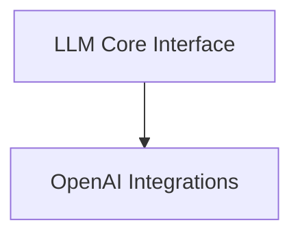

# LLM Handling Module

## Introduction

The `llm_handling` module is responsible for abstracting and managing interactions with various Large Language Models (LLMs). It provides a unified interface to configure, call, and receive responses from different LLM providers, primarily focusing on OpenAI, HuggingFace, and Google models. This module ensures consistent LLM interaction across the system, handling configuration, API calls, and response processing.

## Architecture Overview

The `llm_handling` module is structured into core components for general LLM interaction and specialized components for provider-specific integrations. It orchestrates the configuration of LLM parameters and dispatches requests to the appropriate provider utility functions.

<!-- DIAGRAM_JSON
{
    "direction": "TD",
    "nodes": [
        {"id": "llm_core_interface", "label": "LLM Core Interface", "type": "module", "link": "llm_core_interface.md"},
        {"id": "openai_integrations", "label": "OpenAI Integrations", "type": "module", "link": "openai_integrations.md"}
    ],
    "edges": [
        {"source": "llm_core_interface", "target": "openai_integrations"}
    ],
    "groups": []
}
-->

## Sub-modules

### [LLM Core Interface](llm_core_interface.md)
This sub-module provides the main interface for interacting with various Large Language Models (LLMs) and configuring their parameters. It includes the `call_llm` function for dispatching requests to different providers and `construct_llm_config` for setting up LLM configurations.

### [OpenAI Integrations](openai_integrations.md)
This sub-module handles asynchronous communication with OpenAI's Completion and Chat Completion APIs, including rate limiting. It contains functions like `agenerate_from_openai_completion` and `agenerate_from_openai_chat_completion` for interacting with OpenAI models.
