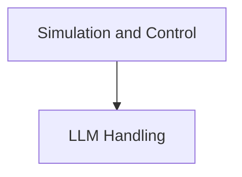

# Main Module Documentation

## Introduction
The main module serves as the central orchestration unit, integrating various functionalities related to Large Language Model (LLM) interaction, action simulation, and control logic. It provides core capabilities for configuring LLMs, executing simulated actions, evaluating their outcomes, and making informed decisions on subsequent actions within a web navigation agent context.

## Architecture Overview
The main module is structured into key sub-modules that handle distinct aspects of its operation. The `llm_handling` module is responsible for all interactions with different LLM providers, abstracting away the specifics of each API. The `simulation_and_control` module manages the process of simulating agent actions in a web environment, evaluating their success, and selecting optimal actions based on user intent and current state.

<!-- DIAGRAM_JSON
{
    "direction": "TD",
    "nodes": [
        {"id": "llm_handling", "label": "LLM Handling", "type": "module", "link": "llm_handling.md"},
        {"id": "simulation_and_control", "label": "Simulation and Control", "type": "module", "link": "simulation_and_control.md"}
    ],
    "edges": [
        {"source": "simulation_and_control", "target": "llm_handling"}
    ],
    "groups": []
}
-->

## Sub-modules

### [LLM Handling](llm_handling.md)
This module is responsible for configuring, calling, and managing interactions with various LLM providers (e.g., OpenAI, HuggingFace, Google). It provides a unified interface for different LLM modes (chat and completion) and handles the underlying API calls.

### [Simulation and Control](simulation_and_control.md)
This module encapsulates the logic for simulating single or multiple actions within a web environment, evaluating the success of these actions against a user's intent, and intelligently selecting the next best actions for the agent to perform. It plays a crucial role in the agent's decision-making process by predicting outcomes and assessing progress towards the task goal.