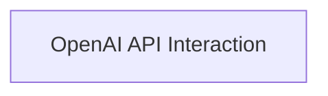

# OpenAI Integrations Module

## Introduction

The `openai_integrations` module provides the core functionalities for interacting with the OpenAI API, specifically for generating text using both the Completion and Chat Completion endpoints. It handles the asynchronous communication with OpenAI's services, including request throttling and necessary environment variable checks.

This module is a child of the `llm_handling` module, which focuses on the broader LLM interaction within the system. It is also related to the `llm_core_interface` module which handles the general LLM configurations and calls, acting as a specialized component for OpenAI specific implementations.

## Architecture Overview

The `openai_integrations` module consists of a single sub-module that encapsulates the logic for direct interaction with the OpenAI API. This structure ensures a clear separation of concerns, making the codebase easier to understand, maintain, and extend.

<!-- DIAGRAM_JSON
{
    "direction": "TD",
    "nodes": [
        {"id": "api_interaction", "label": "OpenAI API Interaction", "type": "module", "link": "api_interaction.md"}
    ],
    "edges": [],
    "groups": []
}
-->

## Sub-modules

### [OpenAI API Interaction](api_interaction.md)

This sub-module (`api_interaction`) contains the asynchronous functions responsible for making calls to the OpenAI Completion and Chat Completion APIs. It includes mechanisms for rate limiting requests and ensures that the `OPENAI_API_KEY` environment variable is set before making any API calls.
