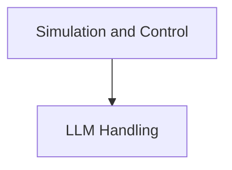

The WebDreamer repository provides a framework for building intelligent web navigation agents. Its core purpose is to orchestrate Large Language Model (LLM) interactions, simulate agent actions within a web environment, evaluate the success of these actions, and make informed decisions to achieve user-defined goals. It integrates functionalities for configuring LLMs, executing simulated actions, assessing outcomes, and selecting optimal actions.

