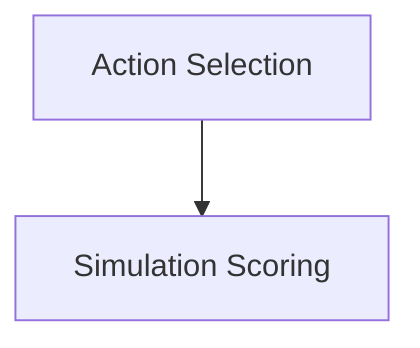

# Simulation and Control Module

## Introduction
The `simulation_and_control` module is a critical component of the system, responsible for simulating potential actions, evaluating their success, and selecting optimal actions for the agent to achieve user-defined tasks. It leverages advanced AI models to predict outcomes and refine the agent's decision-making process in web navigation scenarios.

## Architecture Overview

<!-- DIAGRAM_JSON
{
    "direction": "TD",
    "nodes": [
        {"id": "action_selection", "label": "Action Selection", "type": "module", "link": "action_selection.md"},
        {"id": "simulation_scoring", "label": "Simulation Scoring", "type": "module", "link": "simulation_scoring.md"}
    ],
    "edges": [
        {"source": "action_selection", "target": "simulation_scoring"}
    ],
    "groups": []
}
-->

## Sub-modules

This module is composed of the following key sub-modules:

### [Action Selection](action_selection.md)
The `action_selection` sub-module is responsible for filtering and selecting the most relevant actions for the agent to take at a given step. It analyzes the current webpage state, user intent, and action history to propose a refined set of candidate actions.

### [Simulation Scoring](simulation_scoring.md)
The `simulation_scoring` sub-module handles the core logic of simulating agent actions and evaluating their potential for success. It predicts the outcomes of proposed actions and assigns scores based on their alignment with the user's intent, providing crucial feedback for the overall control loop. This module interacts with the [llm_handling.md](llm_handling.md) for generating predictions and evaluations.