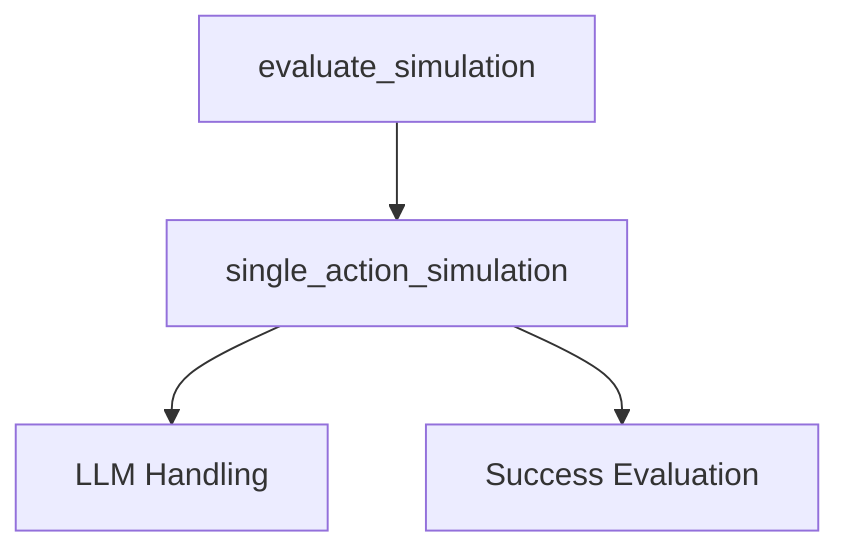

# Module: simulation_execution

The `simulation_execution` module is a core component within the `simulation_scoring` system, dedicated to simulating the potential outcomes of user actions within a web environment and evaluating their effectiveness. It provides functionalities to predict changes based on a given action and assesses the quality of these predictions.

## Architecture and Component Relationships

This module orchestrates the execution of individual action simulations and aggregates their results. It relies on external modules for language model interactions and detailed success evaluation.

<!-- DIAGRAM_JSON
{
    "direction": "TD",
    "nodes": [
        {"id": "evaluate_simulation", "label": "evaluate_simulation", "type": "component", "link": null},
        {"id": "single_action_simulation", "label": "single_action_simulation", "type": "component", "link": null},
        {"id": "llm_handling", "label": "LLM Handling", "type": "external", "link": "llm_handling.md"},
        {"id": "success_evaluation", "label": "Success Evaluation", "type": "external", "link": "success_evaluation.md"}
    ],
    "edges": [
        {"source": "evaluate_simulation", "target": "single_action_simulation"},
        {"source": "single_action_simulation", "target": "llm_handling"},
        {"source": "single_action_simulation", "target": "success_evaluation"}
    ],
    "groups": []
}
-->

### Core Components

#### `single_action_simulation`

This function simulates the outcome of a single action within the web environment. It takes a screenshot, task description, and the action to be simulated as input. It utilizes a `WebWorldModel` (which internally interacts with Large Language Models) to predict the changes that would occur after the action is performed. The predicted "imagination" is then passed to an internal evaluation function (`evaluate_simulation_inner`) to score its quality.

**Key Functionality:**
*   Predicts environmental changes based on an action using `WebWorldModel`.
*   Scores the predicted changes using an evaluation mechanism.

**Dependencies:**
*   `llm_handling`: Implicitly through `WebWorldModel` for LLM inference. For more details, refer to the [llm_handling](llm_handling.md) module documentation.
*   `success_evaluation`: For the `evaluate_simulation_inner` function used to score the simulation. For more details, refer to the [success_evaluation](success_evaluation.md) module documentation.

#### `evaluate_simulation`

The `evaluate_simulation` function orchestrates the execution of multiple `single_action_simulation` calls for a given list of actions. It's designed to run simulations in parallel using a `ThreadPoolExecutor` to efficiently gather results. For each action, it can run multiple simulations (`num_of_sim`) to get a more robust average score. The function then aggregates the scores and imagined outcomes for all actions.

**Key Functionality:**
*   Manages concurrent execution of `single_action_simulation` for multiple actions.
*   Aggregates simulation results and calculates average scores for each action.
*   Prepares and converts the latest screenshot for simulation input.

**Dependencies:**
*   `single_action_simulation`: Directly calls this function for each individual simulation run.

## How the Module Fits into the Overall System

The `simulation_execution` module is a crucial part of the `simulation_scoring` process. It provides the mechanism for actually *running* the simulations that predict the consequences of different actions. The scores generated by this module are then used by higher-level components, such as `action_selection`, to determine the most optimal action to take. By providing a simulated "lookahead" into potential outcomes, it enables intelligent decision-making within the agent's control loop. It heavily relies on the [llm_handling](llm_handling.md) module for its predictive capabilities and feeds its results into the [success_evaluation](success_evaluation.md) components for comprehensive scoring.