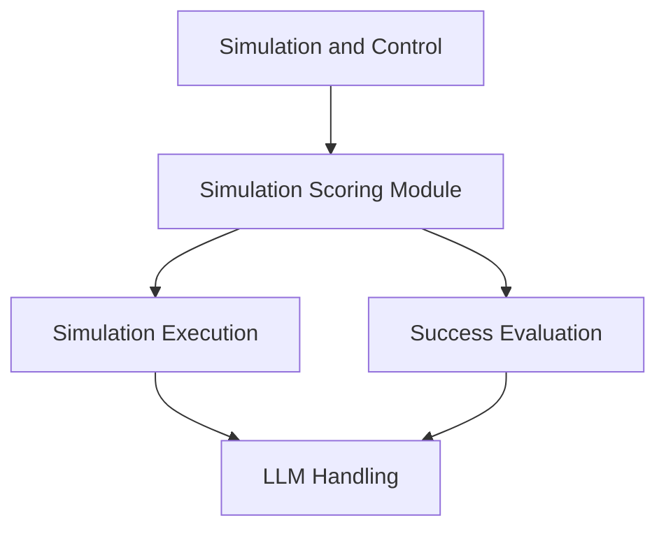

# Simulation Scoring Module

## Introduction and Purpose
The `simulation_scoring` module is a critical component responsible for simulating the potential outcomes of agent actions and evaluating the success of an agent's overall trajectory or individual steps within a web navigation task. It leverages large language models (LLMs) to predict changes in the web environment based on proposed actions and to assess whether the agent is effectively achieving its goals as defined by the user's intent. This module is essential for decision-making processes, allowing the agent to anticipate the consequences of its actions and refine its strategy for optimal performance.

## Architecture Overview

The `simulation_scoring` module is internally structured into two main sub-modules: `simulation_execution` and `success_evaluation`. It integrates closely with the `llm_handling` module for all LLM interactions and plays a central role within the broader [simulation_and_control.md](simulation_and_control.md) module, which orchestrates the agent's overall behavior.

<!-- DIAGRAM_JSON
{
    "direction": "TD",
    "nodes": [
        {"id": "simulation_scoring_overview", "label": "Simulation Scoring", "type": "module"},
        {"id": "simulation_execution", "label": "Simulation Execution", "type": "module", "link": "simulation_execution.md"},
        {"id": "success_evaluation", "label": "Success Evaluation", "type": "module", "link": "success_evaluation.md"},
        {"id": "llm_handling", "label": "LLM Handling", "type": "external", "link": "llm_handling.md"},
        {"id": "simulation_and_control", "label": "Simulation and Control", "type": "external", "link": "simulation_and_control.md"}
    ],
    "edges": [
        {"source": "simulation_scoring_overview", "target": "simulation_execution"},
        {"source": "simulation_scoring_overview", "target": "success_evaluation"},
        {"source": "simulation_execution", "target": "llm_handling"},
        {"source": "success_evaluation", "target": "llm_handling"},
        {"source": "simulation_and_control", "target": "simulation_scoring_overview"}
    ],
    "groups": []
}
-->

## High-Level Functionality

### [Simulation Execution](simulation_execution.md)
This sub-module is responsible for running simulations of proposed actions. It utilizes a `WebWorldModel` to predict the state of the web page after an action is performed. The `single_action_simulation` component performs a single simulation step, generating an "imagination" of the future state and assigning a preliminary score. The `evaluate_simulation` component orchestrates multiple such simulations for a list of actions, aggregating their scores to provide a comprehensive evaluation of potential action sequences. This functionality is crucial for proactive decision-making and exploring possible future states.

### [Success Evaluation](success_evaluation.md)
The `success_evaluation` sub-module focuses on determining whether an agent's actions or overall trajectory successfully meet the user's intent. It contains components like `evaluate_success_with_action` and `evaluate_success`, which take snapshots of the web page, action history, current URL, and user intent as input. These components leverage LLMs to analyze the provided information and output a "success" or "failure" status, along with an indication of whether the agent is "on the right track". This evaluation is vital for feedback mechanisms and for guiding the agent towards task completion.

## Integration with Overall System
The `simulation_scoring` module is a core part of the agent's decision-making loop, typically invoked by the [simulation_and_control.md](simulation_and_control.md) module. It provides crucial feedback on the effectiveness of potential actions, allowing the agent to select the most promising path forward. All interactions with LLMs, such as generating predictions or evaluating success, are handled through the [llm_handling.md](llm_handling.md) module, ensuring consistent LLM configuration and communication.
