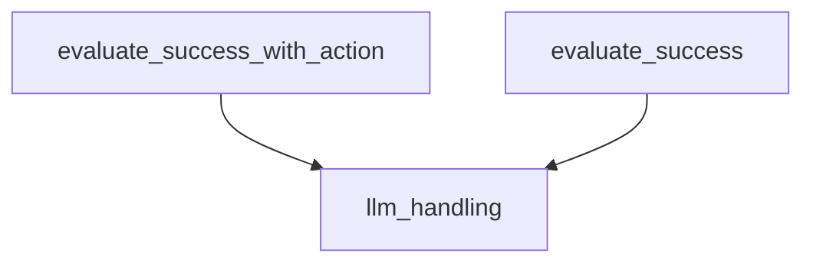

# success_evaluation Module Documentation

The `success_evaluation` module is a critical component within the `simulation_scoring` system, responsible for assessing the success of an agent's actions and overall performance against a user's intent in web navigation tasks. It leverages large language models (LLMs) to provide a nuanced evaluation, distinguishing between outright success, partial success (on the right track), and failure.

## Core Functionality

This module provides two primary functions for evaluating agent performance:
1.  **`evaluate_success_with_action`**: Assesses the success of a *proposed single action* given the current state and history.
2.  **`evaluate_success`**: Evaluates the *overall success* of an agent's entire trajectory after a sequence of actions, considering different task types (information seeking, site navigation, content modification).

## Architecture and Component Relationships

The `success_evaluation` module contains the core logic for evaluating an agent's success. It relies heavily on external LLM services, managed by the [llm_handling module](llm_handling.md), to perform its evaluations.

<!-- DIAGRAM_JSON
{
    "direction": "TD",
    "nodes": [
        {"id": "evaluate_success_with_action", "label": "evaluate_success_with_action", "type": "component", "link": null},
        {"id": "evaluate_success", "label": "evaluate_success", "type": "component", "link": null},
        {"id": "llm_handling", "label": "llm_handling", "type": "external", "link": "llm_handling.md"}
    ],
    "edges": [
        {"source": "evaluate_success_with_action", "target": "llm_handling"},
        {"source": "evaluate_success", "target": "llm_handling"}
    ],
    "groups": []
}
-->

### Components

#### `evaluate_success_with_action`

`simulation_scoring.evaluate_success_with_action(screenshots, actions, current_url, action_description, intent, models, intent_images=None, n=20, top_p=1.0) -> float`

This function evaluates the likelihood of a `proposed action` leading to success. It constructs a prompt for an LLM, including screenshots of the agent's trajectory, action history, current URL, user intent, and the proposed action. The LLM is then queried to determine if the proposed action successfully accomplishes the task, is on the right track, or is a failure. The function returns a score (1.0 for success, 0.5 for on the right track, 0.0 for failure) and the raw message content from the LLM.

**Parameters:**
*   `screenshots` (`list[Image.Image]`): A list of PIL Image objects representing the agent's trajectory snapshots. The last image is the current state.
*   `actions` (`list[str]`): A list of strings detailing the agent's action history.
*   `current_url` (`str`): The URL of the current webpage.
*   `action_description` (`str`): A description of the proposed action to be evaluated.
*   `intent` (`str`): The user's overall intent or goal.
*   `models` (`list[str]`): A list of LLM model names to use for evaluation.
*   `intent_images` (`Optional[Image.Image]`): Optional images related to the user's intent.
*   `n` (`int`): The total number of responses to generate across all models.
*   `top_p` (`float`): The `top_p` sampling parameter for LLM calls.

**Returns:**
*   `float`: The average success score across all LLM responses (1.0, 0.5, or 0.0).

#### `evaluate_success`

`simulation_scoring.evaluate_success(screenshots, actions, current_url, last_reasoning, intent, models, intent_images=None, n=20, top_p=1.0, should_log=False) -> float`

This function evaluates the overall success of an agent's completed trajectory. It considers the entire sequence of actions, the final webpage state (via screenshots), and the agent's final response to the user. The function provides detailed instructions to the LLM for evaluating success based on three distinct task types: information seeking, site navigation, and content modification.

**Task Types:**
*   **Information Seeking**: Requires the agent's response to contain the requested information or explicitly state its unavailability. The bot's final response must be a "stop" action.
*   **Site Navigation**: Success is determined by whether the agent successfully navigated to the specified page, reflected by the final URL and screenshot.
*   **Content Modification**: Success depends on whether the agent committed to the modification (e.g., clicking "post" after writing a comment).

**Parameters:**
*   `screenshots` (`list[Image.Image]`): A list of PIL Image objects representing the agent's trajectory snapshots. The last image is the final state.
*   `actions` (`list[str]`): A list of strings detailing the agent's action history, with the last element being the agent's final response.
*   `current_url` (`str`): The URL of the final webpage state.
*   `last_reasoning` (`str`): The agent's last reasoning step (though not directly used in the prompt construction in the provided code, it's a parameter).
*   `intent` (`str`): The user's overall intent or goal.
*   `models` (`list[str]`): A list of LLM model names to use for evaluation.
*   `intent_images` (`Optional[Image.Image]`): Optional images related to the user's intent.
*   `n` (`int`): The total number of responses to generate across all models.
*   `top_p` (`float`): The `top_p` sampling parameter for LLM calls.
*   `should_log` (`bool`): If `True`, logs detailed input and output from the LLM evaluation.

**Returns:**
*   `float`: The average success score across all LLM responses (1.0 for success, 0.5 for on the right track, 0.0 for failure).

## How the Module Fits into the Overall System

The `success_evaluation` module is a sub-module of `simulation_scoring`. It provides the critical mechanism for automated evaluation of agent performance during simulations. Its outputs are used upstream by the broader `simulation_and_control` system, which includes the [simulation_execution module](simulation_execution.md) and [action_selection module](action_selection.md), to assess and potentially guide agent behavior. By providing objective success metrics, it enables the system to learn and improve agent strategies.
