## Agent-to-Agent Authentication

This module provides various authentication schemes for both client-side requests and server-side validation in agent-to-agent communication. It supports API Key, OAuth2 (Client Credentials, Authorization Code), HTTP Basic, HTTP Digest, Bearer Token, Simple Token, OIDC, Enterprise Token, and mTLS, ensuring secure inter-agent interactions.

<!-- DIAGRAM_JSON
{
    "direction": "TD",
    "nodes": [
        {"id": "client_auth_base", "label": "ClientAuthScheme (Base)", "type": "component", "link": null},
        {"id": "client_api_key", "label": "API Key Auth (Client)", "type": "component", "link": null},
        {"id": "client_bearer", "label": "Bearer Token Auth (Client)", "type": "component", "link": null},
        {"id": "client_basic", "label": "HTTP Basic Auth (Client)", "type": "component", "link": null},
        {"id": "client_digest", "label": "HTTP Digest Auth (Client)", "type": "component", "link": null},
        {"id": "client_oauth2_cred", "label": "OAuth2 Client Credentials (Client)", "type": "component", "link": null},
        {"id": "client_oauth2_code", "label": "OAuth2 Authorization Code (Client)", "type": "component", "link": null},

        {"id": "server_auth_base", "label": "ServerAuthScheme (Base)", "type": "component", "link": null},
        {"id": "server_simple_token", "label": "Simple Token Auth (Server)", "type": "component", "link": null},
        {"id": "server_oidc", "label": "OIDC Auth (Server)", "type": "component", "link": null},
        {"id": "server_oauth2", "label": "OAuth2 Server Auth", "type": "component", "link": null},
        {"id": "server_api_key", "label": "API Key Auth (Server)", "type": "component", "link": null},
        {"id": "server_mtls", "label": "mTLS Server Auth", "type": "component", "link": null},
        {"id": "server_enterprise", "label": "Enterprise Token Auth (Server)", "type": "component", "link": null},

        {"id": "retry_mechanism", "label": "Retry on 401 (Utility)", "type": "component", "link": null},
        {"id": "http_async_client", "label": "httpx.AsyncClient", "type": "external", "link": null},
        {"id": "authenticated_user", "label": "AuthenticatedUser", "type": "external", "link": null},
        {"id": "a2a_types", "label": "a2a_types Module", "type": "external", "link": "a2a_types.md"}
    ],
    "edges": [
        {"source": "client_api_key", "target": "http_async_client", "label": "applies auth"},
        {"source": "client_bearer", "target": "http_async_client", "label": "applies auth"},
        {"source": "client_basic", "target": "http_async_client", "label": "applies auth"},
        {"source": "client_digest", "target": "http_async_client", "label": "configures client"},
        {"source": "client_oauth2_cred", "target": "http_async_client", "label": "applies auth"},
        {"source": "client_oauth2_code", "target": "http_async_client", "label": "applies auth"},
        {"source": "client_api_key", "target": "client_auth_base", "label": "inherits"},
        {"source": "client_bearer", "target": "client_auth_base", "label": "inherits"},
        {"source": "client_basic", "target": "client_auth_base", "label": "inherits"},
        {"source": "client_digest", "target": "client_auth_base", "label": "inherits"},
        {"source": "client_oauth2_cred", "target": "client_auth_base", "label": "inherits"},
        {"source": "client_oauth2_code", "target": "client_auth_base", "label": "inherits"},

        {"source": "retry_mechanism", "target": "client_auth_base", "label": "retries with"},
        {"source": "retry_mechanism", "target": "http_async_client", "label": "makes requests with"},

        {"source": "server_simple_token", "target": "authenticated_user", "label": "returns"},
        {"source": "server_oidc", "target": "authenticated_user", "label": "returns"},
        {"source": "server_oauth2", "target": "authenticated_user", "label": "returns"},
        {"source": "server_api_key", "target": "authenticated_user", "label": "returns"},
        {"source": "server_mtls", "target": "authenticated_user", "label": "returns"},
        {"source": "server_enterprise", "target": "authenticated_user", "label": "returns"},
        {"source": "server_simple_token", "target": "server_auth_base", "label": "inherits"},
        {"source": "server_oidc", "target": "server_auth_base", "label": "inherits"},
        {"source": "server_oauth2", "target": "server_auth_base", "label": "inherits"},
        {"source": "server_api_key", "target": "server_auth_base", "label": "inherits"},
        {"source": "server_mtls", "target": "server_auth_base", "label": "inherits"},
        {"source": "server_enterprise", "target": "server_auth_base", "label": "inherits"},

        {"source": "server_oauth2", "target": "a2a_types", "label": "generates security scheme"}
    ],
    "groups": [
        {"id": "client_schemes_group", "label": "Client Authentication Schemes", "role": "generative", "nodes": ["client_auth_base", "client_api_key", "client_bearer", "client_basic", "client_digest", "client_oauth2_cred", "client_oauth2_code"]},
        {"id": "server_schemes_group", "label": "Server Authentication Schemes", "role": "analytical", "nodes": ["server_auth_base", "server_simple_token", "server_oidc", "server_oauth2", "server_api_key", "server_mtls", "server_enterprise"]},
        {"id": "utility_group", "label": "Authentication Utilities", "role": "analytical", "nodes": ["retry_mechanism"]}
    ]
}
-->

```mermaid
flowchart TD
    subgraph client_schemes_group["Client Authentication Schemes"]
        client_auth_base["ClientAuthScheme (Base)"]
        client_api_key["API Key Auth (Client)"]
        client_bearer["Bearer Token Auth (Client)"]
        client_basic["HTTP Basic Auth (Client)"]
        client_digest["HTTP Digest Auth (Client)"]
        client_oauth2_cred["OAuth2 Client Credentials (Client)"]
        client_oauth2_code["OAuth2 Authorization Code (Client)"]

        client_api_key -->|"inherits"| client_auth_base
        client_bearer -->|"inherits"| client_auth_base
        client_basic -->|"inherits"| client_auth_base
        client_digest -->|"inherits"| client_auth_base
        client_oauth2_cred -->|"inherits"| client_auth_base
        client_oauth2_code -->|"inherits"| client_auth_base
    end

    subgraph server_schemes_group["Server Authentication Schemes"]
        server_auth_base["ServerAuthScheme (Base)"]
        server_simple_token["Simple Token Auth (Server)"]
        server_oidc["OIDC Auth (Server)"]
        server_oauth2["OAuth2 Server Auth"]
        server_api_key["API Key Auth (Server)"]
        server_mtls["mTLS Server Auth"]
        server_enterprise["Enterprise Token Auth (Server)"]

        server_simple_token -->|"inherits"| server_auth_base
        server_oidc -->|"inherits"| server_auth_base
        server_oauth2 -->|"inherits"| server_auth_base
        server_api_key -->|"inherits"| server_auth_base
        server_mtls -->|"inherits"| server_auth_base
        server_enterprise -->|"inherits"| server_auth_base
    end

    subgraph utility_group["Authentication Utilities"]
        retry_mechanism["Retry on 401 (Utility)"]
    end

    http_async_client["httpx.AsyncClient"]
    authenticated_user[("AuthenticatedUser")]
    a2a_types["a2a_types Module"]

    client_api_key -->|"applies auth"| http_async_client
    client_bearer -->|"applies auth"| http_async_client
    client_basic -->|"applies auth"| http_async_client
    client_digest -->|"configures client"| http_async_client
    client_oauth2_cred -->|"applies auth"| http_async_client
    client_oauth2_code -->|"applies auth"| http_async_client

    retry_mechanism -->|"retries with"| client_auth_base
    retry_mechanism -->|"makes requests with"| http_async_client

    server_simple_token -->|"returns"| authenticated_user
    server_oidc -->|"returns"| authenticated_user
    server_oauth2 -->|"returns"| authenticated_user
    server_api_key -->|"returns"| authenticated_user
    server_mtls -->|"returns"| authenticated_user
    server_enterprise -->|"returns"| authenticated_user

    server_oauth2 -.->|"generates security scheme"| a2a_types

    classDef generative fill:#fed7aa,stroke:#ea580c,stroke-width:1px,color:#7c2d12
    classDef analytical fill:#ede9fe,stroke:#8b5cf6,stroke-width:1px,color:#4c1d95
    classDef data fill:#d1fae5,stroke:#10b981,stroke-width:2px,color:#065f46


    class authenticated_user data
    class client_auth_base,client_api_key,client_bearer,client_basic,client_digest,client_oauth2_cred,client_oauth2_code generative
    class server_auth_base,server_simple_token,server_oidc,server_oauth2,server_api_key,server_mtls,server_enterprise,retry_mechanism analytical
```

