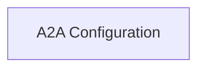

<!-- AUTO_GENERATED_PLACEHOLDER
  reason: LLM did not create .md file for this module
  module_path: crewai_core_framework/a2a_communication/a2a_configuration
  component_count: 3
  generated_at: 2026-05-07T03:11:04.095580
-->

# A2A Configuration

Defines configuration models and default settings for A2A protocol integration, including client and generic A2A configurations, managing endpoints, authentication, and update mechanisms.

<!-- DIAGRAM_JSON
{
    "direction": "TD",
    "nodes": [
        {
            "id": "a2a_configuration",
            "label": "A2A Configuration",
            "type": "module",
            "title": "A2A Configuration",
            "description": "Defines configuration models and default settings for A2A protocol integration, including client and generic A2A configurations, managing endpoints, authentication, and update mechanisms."
        }
    ],
    "edges": [],
    "groups": []
}
-->

