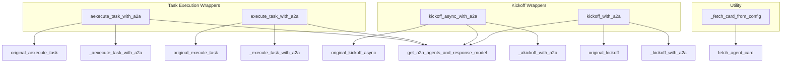

# a2a_core_wrappers
This module provides wrapper functions for agent task execution and kickoff, enabling Agent-to-Agent (A2A) delegation support. It includes both synchronous and asynchronous interfaces for seamless integration.

<!-- DIAGRAM_JSON
{
  "nodes": [
    {"id": "A", "label": "aexecute_task_with_a2a"},
    {"id": "B", "label": "execute_task_with_a2a"},
    {"id": "C", "label": "kickoff_async_with_a2a"},
    {"id": "D", "label": "kickoff_with_a2a"},
    {"id": "E", "label": "_fetch_card_from_config"},
    {"id": "F", "label": "get_a2a_agents_and_response_model"},
    {"id": "G", "label": "_aexecute_task_with_a2a"},
    {"id": "H", "label": "original_aexecute_task"},
    {"id": "I", "label": "_execute_task_with_a2a"},
    {"id": "J", "label": "original_execute_task"},
    {"id": "K", "label": "_akickoff_with_a2a"},
    {"id": "L", "label": "original_kickoff_async"},
    {"id": "M", "label": "_kickoff_with_a2a"},
    {"id": "N", "label": "original_kickoff"},
    {"id": "O", "label": "fetch_agent_card"}
  ],
  "edges": [
    {"source": "A", "target": "F"},
    {"source": "A", "target": "G"},
    {"source": "A", "target": "H"},
    {"source": "B", "target": "F"},
    {"source": "B", "target": "I"},
    {"source": "B", "target": "J"},
    {"source": "C", "target": "F"},
    {"source": "C", "target": "K"},
    {"source": "C", "target": "L"},
    {"source": "D", "target": "F"},
    {"source": "D", "target": "M"},
    {"source": "D", "target": "N"},
    {"source": "E", "target": "O"}
  ],
  "groups": [
    {"id": "group_task_wrappers", "label": "Task Execution Wrappers", "nodes": ["A", "B"]},
    {"id": "group_kickoff_wrappers", "label": "Kickoff Wrappers", "nodes": ["C", "D"]},
    {"id": "group_utility", "label": "Utility", "nodes": ["E"]}
  ]
}
-->
