# a2a_event_types
This module defines various A2A (Agent-to-Agent) event types, encompassing notifications, agent card interactions, parallel delegation, and the full lifecycle of A2A contexts.

<!-- DIAGRAM_JSON
{
  "nodes": [
    {"id": "A2AEventBase", "label": "A2AEventBase"},
    {"id": "A2APushNotificationReceivedEvent", "label": "A2APushNotificationReceivedEvent"},
    {"id": "A2APushNotificationSentEvent", "label": "A2APushNotificationSentEvent"},
    {"id": "A2AAgentCardFetchedEvent", "label": "A2AAgentCardFetchedEvent"},
    {"id": "A2AParallelDelegationStartedEvent", "label": "A2AParallelDelegationStartedEvent"},
    {"id": "A2AParallelDelegationCompletedEvent", "label": "A2AParallelDelegationCompletedEvent"},
    {"id": "A2AContextCreatedEvent", "label": "A2AContextCreatedEvent"},
    {"id": "A2AContextExpiredEvent", "label": "A2AContextExpiredEvent"},
    {"id": "A2AContextIdleEvent", "label": "A2AContextIdleEvent"},
    {"id": "A2AContextCompletedEvent", "label": "A2AContextCompletedEvent"},
    {"id": "A2AContextPrunedEvent", "label": "A2AContextPrunedEvent"}
  ],
  "edges": [
    {"source": "A2AEventBase", "target": "A2APushNotificationReceivedEvent", "label": "inherits"},
    {"source": "A2AEventBase", "target": "A2APushNotificationSentEvent", "label": "inherits"},
    {"source": "A2AEventBase", "target": "A2AAgentCardFetchedEvent", "label": "inherits"},
    {"source": "A2AEventBase", "target": "A2AParallelDelegationStartedEvent", "label": "inherits"},
    {"source": "A2AEventBase", "target": "A2AParallelDelegationCompletedEvent", "label": "inherits"},
    {"source": "A2AEventBase", "target": "A2AContextCreatedEvent", "label": "inherits"},
    {"source": "A2AEventBase", "target": "A2AContextExpiredEvent", "label": "inherits"},
    {"source": "A2AEventBase", "target": "A2AContextIdleEvent", "label": "inherits"},
    {"source": "A2AEventBase", "target": "A2AContextCompletedEvent", "label": "inherits"},
    {"source": "A2AEventBase", "target": "A2AContextPrunedEvent", "label": "inherits"}
  ],
  "groups": [
    {
      "id": "PushNotifications",
      "label": "Push Notifications",
      "nodes": ["A2APushNotificationReceivedEvent", "A2APushNotificationSentEvent"]
    },
    {
      "id": "AgentCard",
      "label": "Agent Card",
      "nodes": ["A2AAgentCardFetchedEvent"]
    },
    {
      "id": "ParallelDelegation",
      "label": "Parallel Delegation",
      "nodes": ["A2AParallelDelegationStartedEvent", "A2AParallelDelegationCompletedEvent"]
    },
    {
      "id": "ContextLifecycle",
      "label": "Context Lifecycle",
      "nodes": ["A2AContextCreatedEvent", "A2AContextExpiredEvent", "A2AContextIdleEvent", "A2AContextCompletedEvent", "A2AContextPrunedEvent"]
    }
  ]
}
-->

```mermaid
flowchart TD
    subgraph Push Notifications
        A2APushNotificationReceivedEvent
        A2APushNotificationSentEvent
    end

    subgraph Agent Card
        A2AAgentCardFetchedEvent
    end

    subgraph Parallel Delegation
        A2AParallelDelegationStartedEvent
        A2AParallelDelegationCompletedEvent
    end

    subgraph Context Lifecycle
        A2AContextCreatedEvent
        A2AContextExpiredEvent
        A2AContextIdleEvent
        A2AContextCompletedEvent
        A2AContextPrunedEvent
    end

    A2AEventBase --> A2APushNotificationReceivedEvent
    A2AEventBase --> A2APushNotificationSentEvent
    A2AEventBase --> A2AAgentCardFetchedEvent
    A2AEventBase --> A2AParallelDelegationStartedEvent
    A2AEventBase --> A2AParallelDelegationCompletedEvent
    A2AEventBase --> A2AContextCreatedEvent
    A2AEventBase --> A2AContextExpiredEvent
    A2AEventBase --> A2AContextIdleEvent
    A2AEventBase --> A2AContextCompletedEvent
    A2AEventBase --> A2AContextPrunedEvent
```
