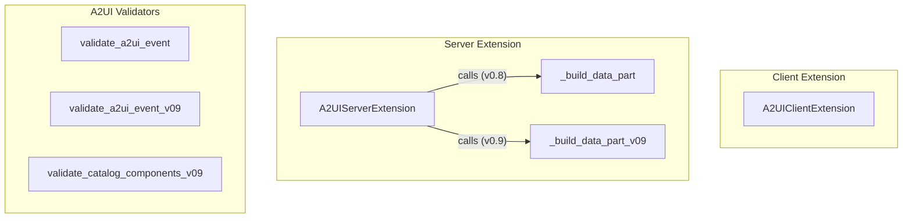

# a2a_extensions_a2ui
This module provides client and server extensions for integrating A2UI (Agent-to-UI) declarative UI generation into A2A (Agent-to-Agent) conversations, supporting both v0.8 and v0.9 of the A2UI protocol.

<!-- DIAGRAM_JSON
{
  "nodes": [
    {"id": "A", "label": "A2UIClientExtension", "type": "class"},
    {"id": "B", "label": "A2UIServerExtension", "type": "class"},
    {"id": "C", "label": "_build_data_part", "type": "function"},
    {"id": "D", "label": "_build_data_part_v09", "type": "function"},
    {"id": "E", "label": "validate_a2ui_event", "type": "function"},
    {"id": "F", "label": "validate_a2ui_event_v09", "type": "function"},
    {"id": "G", "label": "validate_catalog_components_v09", "type": "function"}
  ],
  "edges": [
    {"source": "B", "target": "C", "label": "calls (v0.8)"},
    {"source": "B", "target": "D", "label": "calls (v0.9)"}
  ],
  "groups": [
    {"id": "client_ext", "label": "Client Extension", "nodes": ["A"]},
    {"id": "server_ext", "label": "Server Extension", "nodes": ["B", "C", "D"]},
    {"id": "validators", "label": "A2UI Validators", "nodes": ["E", "F", "G"]}
  ]
}
-->
