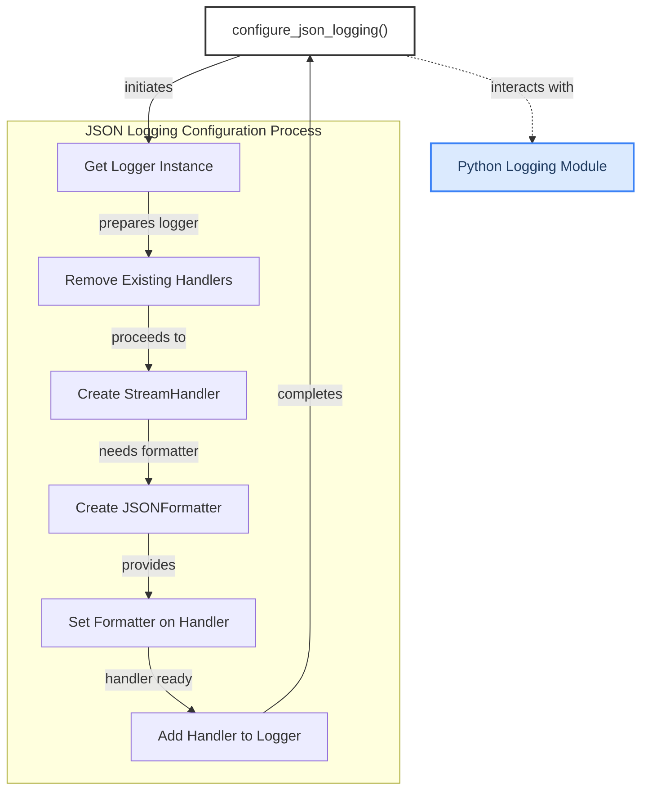

# A2A Logging Module

This module configures a dedicated logger for the Agent-to-Agent (A2A) communication framework, ensuring all emitted logs are in a structured JSON format and directed to a stream handler.

<!-- DIAGRAM_JSON
{
    "direction": "TD",
    "nodes": [
        {"id": "configure_json_logging_func", "label": "configure_json_logging()", "type": "component", "link": null},
        {"id": "get_logger", "label": "Get Logger Instance", "type": "component", "link": null},
        {"id": "remove_old_handlers", "label": "Remove Existing Handlers", "type": "component", "link": null},
        {"id": "create_stream_handler", "label": "Create StreamHandler", "type": "component", "link": null},
        {"id": "create_json_formatter", "label": "Create JSONFormatter", "type": "component", "link": null},
        {"id": "set_formatter", "label": "Set Formatter on Handler", "type": "component", "link": null},
        {"id": "add_new_handler", "label": "Add Handler to Logger", "type": "component", "link": null},
        {"id": "logging_module", "label": "Python Logging Module", "type": "external", "link": null}
    ],
    "edges": [
        {"source": "configure_json_logging_func", "target": "get_logger", "label": "initiates"},
        {"source": "get_logger", "target": "remove_old_handlers", "label": "prepares logger"},
        {"source": "remove_old_handlers", "target": "create_stream_handler", "label": "proceeds to"},
        {"source": "create_stream_handler", "target": "create_json_formatter", "label": "needs formatter"},
        {"source": "create_json_formatter", "target": "set_formatter", "label": "provides"},
        {"source": "set_formatter", "target": "add_new_handler", "label": "handler ready"},
        {"source": "add_new_handler", "target": "configure_json_logging_func", "label": "completes"},
        {"source": "configure_json_logging_func", "target": "logging_module", "label": "interacts with"}
    ],
    "groups": [
        {"id": "json_logging_process", "label": "JSON Logging Configuration Process", "role": "analytical", "nodes": ["get_logger", "remove_old_handlers", "create_stream_handler", "create_json_formatter", "set_formatter", "add_new_handler"]}
    ]
}
-->
