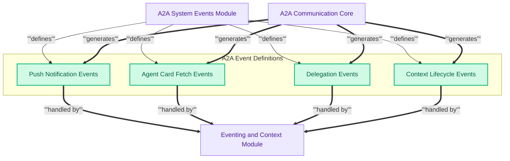

## A2A System Event Definitions

This module defines a comprehensive set of system events for Agent-to-Agent (A2A) communication, covering push notifications, agent card fetching, parallel delegation, and the lifecycle management of A2A interaction contexts.

<!-- DIAGRAM_JSON
{
    "direction": "TD",
    "nodes": [
        {"id": "a2a_system_events_module", "label": "A2A System Events Module", "type": "component", "link": null},
        {"id": "push_notif_events", "label": "Push Notification Events", "type": "component", "link": null},
        {"id": "agent_card_events", "label": "Agent Card Fetch Events", "type": "component", "link": null},
        {"id": "delegation_events", "label": "Delegation Events", "type": "component", "link": null},
        {"id": "context_events", "label": "Context Lifecycle Events", "type": "component", "link": null},
        {"id": "a2a_communication_core", "label": "A2A Communication Core", "type": "external", "link": "a2a_communication.md"},
        {"id": "eventing_and_context_module", "label": "Eventing and Context Module", "type": "external", "link": "eventing_and_context.md"}
    ],
    "edges": [
        {"source": "a2a_system_events_module", "target": "push_notif_events", "label": "defines"},
        {"source": "a2a_system_events_module", "target": "agent_card_events", "label": "defines"},
        {"source": "a2a_system_events_module", "target": "delegation_events", "label": "defines"},
        {"source": "a2a_system_events_module", "target": "context_events", "label": "defines"},
        {"source": "a2a_communication_core", "target": "push_notif_events", "label": "generates"},
        {"source": "a2a_communication_core", "target": "agent_card_events", "label": "generates"},
        {"source": "a2a_communication_core", "target": "delegation_events", "label": "generates"},
        {"source": "a2a_communication_core", "target": "context_events", "label": "generates"},
        {"source": "push_notif_events", "target": "eventing_and_context_module", "label": "handled by"},
        {"source": "agent_card_events", "target": "eventing_and_context_module", "label": "handled by"},
        {"source": "delegation_events", "target": "eventing_and_context_module", "label": "handled by"},
        {"source": "context_events", "target": "eventing_and_context_module", "label": "handled by"}
    ],
    "groups": [
        {"id": "event_definitions", "label": "A2A Event Definitions", "role": "data", "nodes": ["push_notif_events", "agent_card_events", "delegation_events", "context_events"]}
    ]
}
-->

