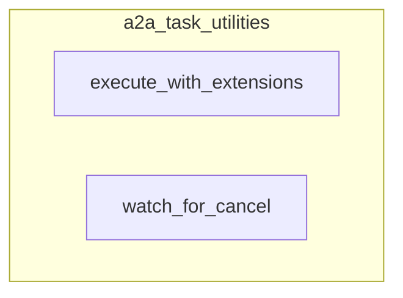

# a2a_task_utilities
Provides utilities for A2A task management, including executing tasks with server extensions and monitoring for cancellation requests.

<!-- DIAGRAM_JSON
{
  "nodes": [
    {
      "id": "execute_with_extensions",
      "label": "execute_with_extensions",
      "type": "function"
    },
    {
      "id": "watch_for_cancel",
      "label": "watch_for_cancel",
      "type": "function"
    }
  ],
  "edges": [],
  "groups": [
    {
      "id": "a2a_task_utilities",
      "label": "a2a_task_utilities",
      "contains": ["execute_with_extensions", "watch_for_cancel"]
    }
  ]
}
-->
