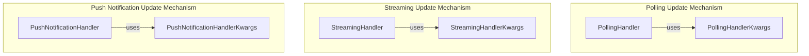

# a2a_update_handlers
This module defines various strategies for handling Agent-to-Agent (A2A) updates, including polling, streaming, and push notifications, along with their respective configuration parameters.

<!-- DIAGRAM_JSON
{
  "nodes": [
    {"id": "PollingHandlerKwargs", "label": "PollingHandlerKwargs", "type": "class"},
    {"id": "StreamingHandlerKwargs", "label": "StreamingHandlerKwargs", "type": "class"},
    {"id": "PushNotificationHandlerKwargs", "label": "PushNotificationHandlerKwargs", "type": "class"},
    {"id": "PollingHandler", "label": "PollingHandler", "type": "class"},
    {"id": "PushNotificationHandler", "label": "PushNotificationHandler", "type": "class"},
    {"id": "StreamingHandler", "label": "StreamingHandler", "type": "class"}
  ],
  "edges": [
    {"source": "PollingHandler", "target": "PollingHandlerKwargs", "label": "uses"},
    {"source": "PushNotificationHandler", "target": "PushNotificationHandlerKwargs", "label": "uses"},
    {"source": "StreamingHandler", "target": "StreamingHandlerKwargs", "label": "uses"}
  ],
  "groups": [
    {"id": "Polling", "label": "Polling Update Mechanism", "members": ["PollingHandler", "PollingHandlerKwargs"]},
    {"id": "Streaming", "label": "Streaming Update Mechanism", "members": ["StreamingHandler", "StreamingHandlerKwargs"]},
    {"id": "PushNotifications", "label": "Push Notification Update Mechanism", "members": ["PushNotificationHandler", "PushNotificationHandlerKwargs"]}
  ]
}
-->
