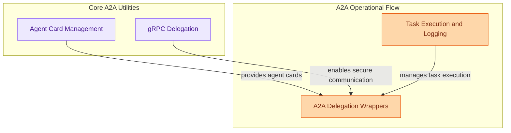

# A2A Utilities and Delegation
This module provides essential utilities for Agent-to-Agent (A2A) communication, encompassing agent card management, gRPC delegation, task execution with extensions, and wrappers for integrating A2A capabilities into agent operations.

<!-- DIAGRAM_JSON
{
    "direction": "TD",
    "nodes": [
        {"id": "agent_card_management", "label": "Agent Card Management", "type": "module", "link": "agent_card_management.md"},
        {"id": "grpc_delegation", "label": "gRPC Delegation", "type": "module", "link": "grpc_delegation.md"},
        {"id": "task_execution_logging", "label": "Task Execution and Logging", "type": "module", "link": "task_execution_logging.md"},
        {"id": "a2a_delegation_wrappers", "label": "A2A Delegation Wrappers", "type": "module", "link": "a2a_delegation_wrappers.md"}
    ],
    "edges": [
        {"source": "agent_card_management", "target": "a2a_delegation_wrappers", "label": "provides agent cards"},
        {"source": "grpc_delegation", "target": "a2a_delegation_wrappers", "label": "enables secure communication"},
        {"source": "task_execution_logging", "target": "a2a_delegation_wrappers", "label": "manages task execution"}
    ],
    "groups": [
        {"id": "core_a2a_utilities", "label": "Core A2A Utilities", "role": "analytical", "nodes": ["agent_card_management", "grpc_delegation"]},
        {"id": "a2a_operational_flow", "label": "A2A Operational Flow", "role": "generative", "nodes": ["task_execution_logging", "a2a_delegation_wrappers"]}
    ]
}
-->
