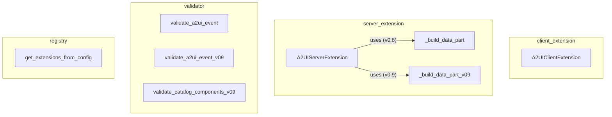

# a2ui_extensions
This module provides A2UI client and server extensions for A2A agents, enabling declarative UI generation and validation of A2UI messages and events.

<!-- DIAGRAM_JSON
{
  "nodes": [
    {"id": "A2UIClientExtension", "label": "A2UIClientExtension"},
    {"id": "A2UIServerExtension", "label": "A2UIServerExtension"},
    {"id": "_build_data_part", "label": "_build_data_part"},
    {"id": "_build_data_part_v09", "label": "_build_data_part_v09"},
    {"id": "validate_a2ui_event", "label": "validate_a2ui_event"},
    {"id": "validate_a2ui_event_v09", "label": "validate_a2ui_event_v09"},
    {"id": "validate_catalog_components_v09", "label": "validate_catalog_components_v09"},
    {"id": "get_extensions_from_config", "label": "get_extensions_from_config"}
  ],
  "edges": [
    {"source": "A2UIServerExtension", "target": "_build_data_part", "label": "uses (v0.8)"},
    {"source": "A2UIServerExtension", "target": "_build_data_part_v09", "label": "uses (v0.9)"}
  ],
  "groups": [
    {"id": "client_extension", "label": "client_extension", "nodes": ["A2UIClientExtension"]},
    {"id": "server_extension", "label": "server_extension", "nodes": ["A2UIServerExtension", "_build_data_part", "_build_data_part_v09"]},
    {"id": "validator", "label": "validator", "nodes": ["validate_a2ui_event", "validate_a2ui_event_v09", "validate_catalog_components_v09"]},
    {"id": "registry", "label": "registry", "nodes": ["get_extensions_from_config"]}
  ]
}
-->
