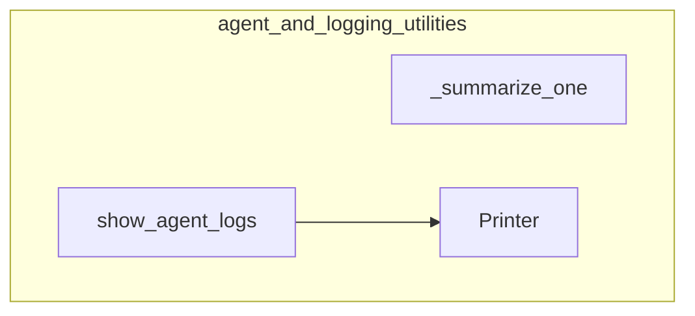

# agent_and_logging_utilities
This module provides core utilities for managing agent interactions, including displaying detailed agent execution logs with colored output and summarizing conversation chunks from LLM messages.

<!-- DIAGRAM_JSON
{
  "nodes": [
    {"id": "_summarize_one", "label": "_summarize_one"},
    {"id": "show_agent_logs", "label": "show_agent_logs"},
    {"id": "Printer", "label": "Printer"}
  ],
  "edges": [
    {"source": "show_agent_logs", "target": "Printer", "label": "uses"}
  ],
  "groups": [
    {"id": "agent_and_logging_utilities", "label": "agent_and_logging_utilities", "nodes": ["_summarize_one", "show_agent_logs", "Printer"]}
  ]
}
-->
