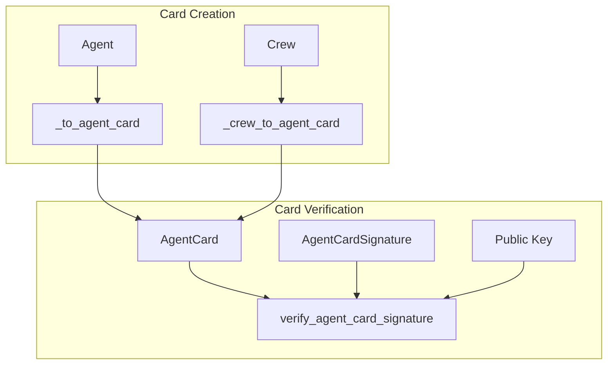

# agent_card_management
This module provides utilities for generating AgentCards from various sources (Agents, Crews) and for securely verifying the digital signatures of these AgentCards.

<!-- DIAGRAM_JSON
{
  "nodes": [
    {
      "id": "A",
      "label": "_to_agent_card"
    },
    {
      "id": "B",
      "label": "_crew_to_agent_card"
    },
    {
      "id": "C",
      "label": "verify_agent_card_signature"
    },
    {
      "id": "Agent",
      "label": "Agent"
    },
    {
      "id": "Crew",
      "label": "Crew"
    },
    {
      "id": "AC",
      "label": "AgentCard"
    },
    {
      "id": "Signature",
      "label": "AgentCardSignature"
    },
    {
      "id": "PublicKey",
      "label": "Public Key"
    }
  ],
  "edges": [
    {
      "source": "Agent",
      "target": "A"
    },
    {
      "source": "Crew",
      "target": "B"
    },
    {
      "source": "A",
      "target": "AC"
    },
    {
      "source": "B",
      "target": "AC"
    },
    {
      "source": "AC",
      "target": "C"
    },
    {
      "source": "Signature",
      "target": "C"
    },
    {
      "source": "PublicKey",
      "target": "C"
    }
  ],
  "groups": [
    {
      "id": "CardCreation",
      "label": "Card Creation",
      "nodes": [
        "A",
        "B"
      ]
    },
    {
      "id": "CardVerification",
      "label": "Card Verification",
      "nodes": [
        "C"
      ]
    }
  ]
}
-->
