# Agent and Crew Definition
This module defines the core components for agents and crews, including metaclasses for extending agent functionality, various adapters for integrating with different LLM frameworks, and a lightweight agent for direct, tool-augmented execution, all while supporting features like A2A communication, memory, and guardrails.

<!-- DIAGRAM_JSON
{
    "direction": "TD",
    "nodes": [
        {"id": "agent_meta", "label": "Agent Metaclass (Extension Support)", "type": "component", "link": null},
        {"id": "agent_decorator", "label": "Agent Method Decorator", "type": "component", "link": null},
        {"id": "crew_base_meta", "label": "Crew Base Metaclass (Decorator)", "type": "component", "link": null},
        {"id": "lite_agent", "label": "Lite Agent (Direct Execution)", "type": "component", "link": null},
        {"id": "agent_executor", "label": "Crew Agent Executor", "type": "component", "link": null},
        {"id": "tools_handler", "label": "Tools Handler", "type": "component", "link": null},
        {"id": "agent_adapters", "label": "Agent Adapters (LLM Frameworks)", "type": "component", "link": null},
        {"id": "a2a_comm", "label": "A2A Communication", "type": "external", "link": "a2a_communication.md"},
        {"id": "llm_integration", "label": "LLM Integration", "type": "external", "link": "llm_integration.md"},
        {"id": "tools_integrations", "label": "Tools and Integrations", "type": "external", "link": "tools_and_integrations.md"},
        {"id": "memory_mgmt", "label": "Memory Management", "type": "external", "link": "memory_management.md"},
        {"id": "tasks_flow", "label": "Tasks and Flow", "type": "external", "link": "tasks_and_flow.md"},
        {"id": "eventing_context", "label": "Eventing and Context", "type": "external", "link": "eventing_and_context.md"},
        {"id": "file_proc_cache", "label": "File Processing and Cache", "type": "external", "link": "file_processing_and_cache.md"}
    ],
    "edges": [
        {"source": "agent_meta", "target": "a2a_comm", "label": "wraps for"},
        {"source": "lite_agent", "target": "a2a_comm", "label": "delegates tasks via"},
        {"source": "lite_agent", "target": "llm_integration", "label": "uses"},
        {"source": "lite_agent", "target": "tools_integrations", "label": "uses"},
        {"source": "lite_agent", "target": "memory_mgmt", "label": "recalls from and saves to"},
        {"source": "lite_agent", "target": "tasks_flow", "label": "applies guardrails from"},
        {"source": "lite_agent", "target": "eventing_context", "label": "emits events to"},
        {"source": "lite_agent", "target": "file_proc_cache", "label": "handles input"},
        {"source": "agent_adapters", "target": "llm_integration", "label": "integrates with"},
        {"source": "agent_adapters", "target": "tools_integrations", "label": "handles"},
        {"source": "agent_executor", "target": "agent_adapters", "label": "utilizes"},
        {"source": "agent_executor", "target": "tools_handler", "label": "delegates tool use to"},
        {"source": "tools_handler", "target": "tools_integrations", "label": "manages"}
    ],
    "groups": [
        {"id": "agent_definitions", "label": "Agent Definitions", "role": "surface", "nodes": ["agent_meta", "agent_decorator", "crew_base_meta"]},
        {"id": "agent_execution", "label": "Agent Execution Pipeline", "role": "generative", "nodes": ["lite_agent", "agent_executor", "tools_handler", "agent_adapters"]}
    ]
}
-->

```mermaid
flowchart TD
    subgraph agent_definitions["Agent Definitions"]
        agent_meta["Agent Metaclass (Extension Support)"]
        agent_decorator["Agent Method Decorator"]
        crew_base_meta["Crew Base Metaclass (Decorator)"]
    end

    subgraph agent_execution["Agent Execution Pipeline"]
        lite_agent["Lite Agent (Direct Execution)"]
        agent_executor["Crew Agent Executor"]
        tools_handler["Tools Handler"]
        agent_adapters["Agent Adapters (LLM Frameworks)"]
    end

    a2a_comm["A2A Communication"]
    llm_integration["LLM Integration"]
    tools_integrations["Tools and Integrations"]
    memory_mgmt["Memory Management"]
    tasks_flow["Tasks and Flow"]
    eventing_context["Eventing and Context"]
    file_proc_cache["File Processing and Cache"]

    agent_meta -->|'''wraps for'''| a2a_comm
    lite_agent -->|'''delegates tasks via'''| a2a_comm
    lite_agent -->|'''uses'''| llm_integration
    lite_agent -->|'''uses'''| tools_integrations
    lite_agent -->|'''recalls from and saves to'''| memory_mgmt
    lite_agent -->|'''applies guardrails from'''| tasks_flow
    lite_agent -->|'''emits events to'''| eventing_context
    lite_agent -->|'''handles input'''| file_proc_cache
    agent_adapters -->|'''integrates with'''| llm_integration
    agent_adapters -->|'''handles'''| tools_integrations
    agent_executor -->|'''utilizes'''| agent_adapters
    agent_executor -->|'''delegates tool use to'''| tools_handler
    tools_handler -->|'''manages'''| tools_integrations

    classDef surface fill:#dbeafe,stroke:#3b82f6,stroke-width:2px,color:#1e3a5f
    classDef generative fill:#fed7aa,stroke:#ea580c,stroke-width:1px,color:#7c2d12
    classDef data fill:#d1fae5,stroke:#10b981,stroke-width:2px,color:#065f46

    class agent_meta,agent_decorator,crew_base_meta surface
    class lite_agent,agent_executor,tools_handler,agent_adapters generative
    class a2a_comm,llm_integration,tools_integrations,memory_mgmt,tasks_flow,eventing_context,file_proc_cache data

    click a2a_comm "a2a_communication.md" "View A2A Communication Module"
    click llm_integration "llm_integration.md" "View LLM Integration Module"
    click tools_integrations "tools_and_integrations.md" "View Tools and Integrations Module"
    click memory_mgmt "memory_management.md" "View Memory Management Module"
    click tasks_flow "tasks_and_flow.md" "View Tasks and Flow Module"
    click eventing_context "eventing_and_context.md" "View Eventing and Context Module"
    click file_proc_cache "file_processing_and_cache.md" "View File Processing and Cache Module"
```

