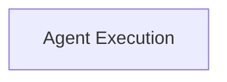

<!-- AUTO_GENERATED_PLACEHOLDER
  reason: LLM did not create .md file for this module
  module_path: crewai_core_framework/agents_and_crews/agent_execution
  component_count: 2
  generated_at: 2026-05-07T03:07:02.957864
-->

# Agent Execution

Manages the lifecycle of agent execution, including prompt handling, LLM interaction, tool usage, and result processing.

<!-- DIAGRAM_JSON
{
    "direction": "TD",
    "nodes": [
        {
            "id": "agent_execution",
            "label": "Agent Execution",
            "type": "module",
            "title": "Agent Execution",
            "description": "Manages the lifecycle of agent execution, including prompt handling, LLM interaction, tool usage, and result processing."
        }
    ],
    "edges": [],
    "groups": []
}
-->

