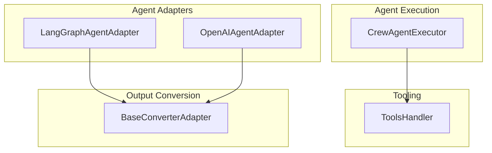

# agent_execution_and_adapters
This module orchestrates agent execution, manages tool interactions, and provides abstract and concrete adapters for integrating various agent frameworks and handling structured output conversion.

<!-- DIAGRAM_JSON
{
  "nodes": [
    {
      "id": "CrewAgentExecutor",
      "label": "CrewAgentExecutor",
      "description": "Manages the execution lifecycle of an agent."
    },
    {
      "id": "ToolsHandler",
      "label": "ToolsHandler",
      "description": "Handles tool usage callbacks and caching."
    },
    {
      "id": "BaseConverterAdapter",
      "label": "BaseConverterAdapter",
      "description": "Abstract base for converting agent outputs to structured formats."
    },
    {
      "id": "LangGraphAgentAdapter",
      "label": "LangGraphAgentAdapter",
      "description": "Adapter for LangGraph agents, integrating with CrewAI."
    },
    {
      "id": "OpenAIAgentAdapter",
      "label": "OpenAIAgentAdapter",
      "description": "Adapter for OpenAI Assistants, integrating with CrewAI."
    }
  ],
  "edges": [
    {
      "source": "CrewAgentExecutor",
      "target": "ToolsHandler",
      "label": "uses"
    },
    {
      "source": "LangGraphAgentAdapter",
      "target": "BaseConverterAdapter",
      "label": "uses (via concrete adapter)"
    },
    {
      "source": "OpenAIAgentAdapter",
      "target": "BaseConverterAdapter",
      "label": "uses (via concrete adapter)"
    }
  ],
  "groups": [
    {
      "id": "agent_execution",
      "label": "Agent Execution",
      "nodes": ["CrewAgentExecutor"]
    },
    {
      "id": "tooling",
      "label": "Tooling",
      "nodes": ["ToolsHandler"]
    },
    {
      "id": "agent_adapters",
      "label": "Agent Adapters",
      "nodes": ["LangGraphAgentAdapter", "OpenAIAgentAdapter"]
    },
    {
      "id": "output_conversion",
      "label": "Output Conversion",
      "nodes": ["BaseConverterAdapter"]
    }
  ]
}
-->
