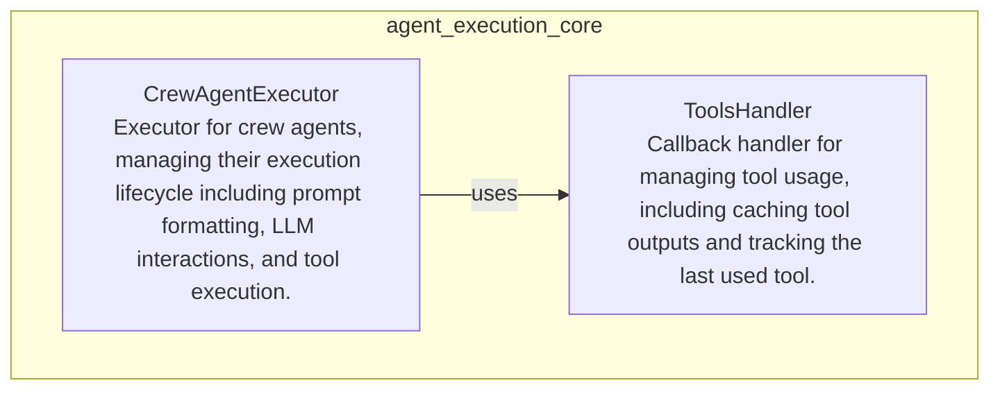

# agent_execution_core
This module defines the core components for agent execution, including the main executor and a dedicated handler for managing tool interactions and caching.

<!-- DIAGRAM_JSON
{
  "nodes": [
    {
      "id": "CrewAgentExecutor",
      "label": "CrewAgentExecutor",
      "description": "Executor for crew agents, managing their execution lifecycle including prompt formatting, LLM interactions, and tool execution."
    },
    {
      "id": "ToolsHandler",
      "label": "ToolsHandler",
      "description": "Callback handler for managing tool usage, including caching tool outputs and tracking the last used tool."
    }
  ],
  "edges": [
    {
      "source": "CrewAgentExecutor",
      "target": "ToolsHandler",
      "label": "uses"
    }
  ],
  "groups": [
    {
      "id": "agent_execution_core",
      "label": "agent_execution_core",
      "nodes": ["CrewAgentExecutor", "ToolsHandler"]
    }
  ]
}
-->
