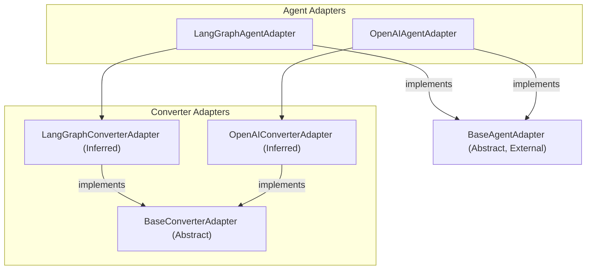

# agent_integration_adapters
This module provides various agent integration adapters, including an abstract base class for output conversion and concrete implementations for LangGraph and OpenAI agents, facilitating their use within the CrewAI framework.

<!-- DIAGRAM_JSON
{
    "nodes": [
        {
            "id": "BCA",
            "label": "BaseConverterAdapter",
            "type": "class",
            "properties": {
                "abstract": true
            }
        },
        {
            "id": "LGAA",
            "label": "LangGraphAgentAdapter",
            "type": "class"
        },
        {
            "id": "OAAA",
            "label": "OpenAIAgentAdapter",
            "type": "class"
        },
        {
            "id": "BAA",
            "label": "BaseAgentAdapter",
            "type": "class",
            "properties": {
                "external": true,
                "abstract": true
            }
        },
        {
            "id": "LGCA",
            "label": "LangGraphConverterAdapter",
            "type": "class",
            "properties": {
                "inferred": true
            }
        },
        {
            "id": "OICA",
            "label": "OpenAIConverterAdapter",
            "type": "class",
            "properties": {
                "inferred": true
            }
        }
    ],
    "edges": [
        {
            "source": "LGAA",
            "target": "BAA",
            "type": "inheritance"
        },
        {
            "source": "OAAA",
            "target": "BAA",
            "type": "inheritance"
        },
        {
            "source": "LGCA",
            "target": "BCA",
            "type": "inheritance"
        },
        {
            "source": "OICA",
            "target": "BCA",
            "type": "inheritance"
        },
        {
            "source": "LGAA",
            "target": "LGCA",
            "type": "composition"
        },
        {
            "source": "OAAA",
            "target": "OICA",
            "type": "composition"
        }
    ],
    "groups": [
        {
            "id": "agent_adapters_group",
            "label": "Agent Adapters",
            "nodes": [
                "LGAA",
                "OAAA"
            ]
        },
        {
            "id": "converter_adapters_group",
            "label": "Converter Adapters",
            "nodes": [
                "BCA",
                "LGCA",
                "OICA"
            ]
        }
    ]
}
-->
