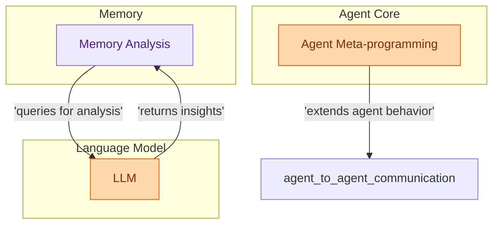

# Agent Meta and Memory Management
This module manages agent metadata and dynamically extends agent capabilities through metaclasses, while also handling intelligent memory analysis and consolidation using LLM-driven insights for efficient knowledge retention.
<!-- DIAGRAM_JSON
{
    "direction": "TD",
    "nodes": [
        {
            "id": "agent_meta_and_memory",
            "label": "Agent Meta and Memory Management",
            "type": "module"
        },
        {
            "id": "agent_meta_programming",
            "label": "Agent Meta-programming",
            "type": "module",
            "link": "agent_meta_programming.md"
        },
        {
            "id": "memory_analysis",
            "label": "Memory Analysis",
            "type": "module",
            "link": "memory_analysis.md"
        },
        {
            "id": "llm",
            "label": "LLM",
            "type": "external"
        },
        {
            "id": "agent_to_agent_communication",
            "label": "agent_to_agent_communication",
            "type": "external",
            "_repaired": "g2_injected_endpoint"
        }
    ],
    "edges": [
        {
            "source": "agent_meta_programming",
            "target": "agent_to_agent_communication",
            "label": "extends agent behavior"
        },
        {
            "source": "memory_analysis",
            "target": "llm",
            "label": "queries for analysis"
        },
        {
            "source": "llm",
            "target": "memory_analysis",
            "label": "returns insights"
        }
    ],
    "groups": [
        {
            "id": "agent_core",
            "label": "Agent Core",
            "role": "generative",
            "nodes": [
                "agent_meta_programming"
            ]
        },
        {
            "id": "memory_component",
            "label": "Memory",
            "role": "analytical",
            "nodes": [
                "memory_analysis"
            ]
        },
        {
            "id": "language_model",
            "label": "Language Model",
            "role": "generative",
            "nodes": [
                "llm"
            ]
        }
    ]
}
-->
