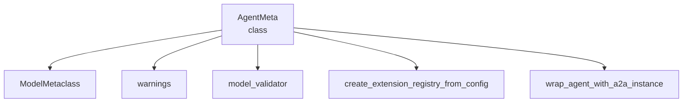

# agent_meta_programming
This module defines `AgentMeta`, a metaclass that enables agent extensions by detecting fields like 'a2a' in class annotations and applying wrapper logic during class creation.

<!-- DIAGRAM_JSON
{
    "nodes": [
        {
            "id": "AgentMeta",
            "label": "AgentMeta",
            "type": "class",
            "path": "lib.crewai.src.crewai.agent.internal.meta.AgentMeta"
        },
        {
            "id": "ModelMetaclass",
            "label": "ModelMetaclass",
            "type": "external",
            "_repaired": "g2_injected_endpoint"
        },
        {
            "id": "warnings",
            "label": "warnings",
            "type": "external",
            "_repaired": "g2_injected_endpoint"
        },
        {
            "id": "model_validator",
            "label": "model_validator",
            "type": "external",
            "_repaired": "g2_injected_endpoint"
        },
        {
            "id": "create_extension_registry_from_config",
            "label": "create_extension_registry_from_config",
            "type": "external",
            "_repaired": "g2_injected_endpoint"
        },
        {
            "id": "wrap_agent_with_a2a_instance",
            "label": "wrap_agent_with_a2a_instance",
            "type": "external",
            "_repaired": "g2_injected_endpoint"
        }
    ],
    "edges": [
        {
            "source": "AgentMeta",
            "target": "ModelMetaclass",
            "type": "uses"
        },
        {
            "source": "AgentMeta",
            "target": "warnings",
            "type": "uses"
        },
        {
            "source": "AgentMeta",
            "target": "model_validator",
            "type": "uses"
        },
        {
            "source": "AgentMeta",
            "target": "create_extension_registry_from_config",
            "type": "uses"
        },
        {
            "source": "AgentMeta",
            "target": "wrap_agent_with_a2a_instance",
            "type": "uses"
        }
    ],
    "groups": []
}
-->
