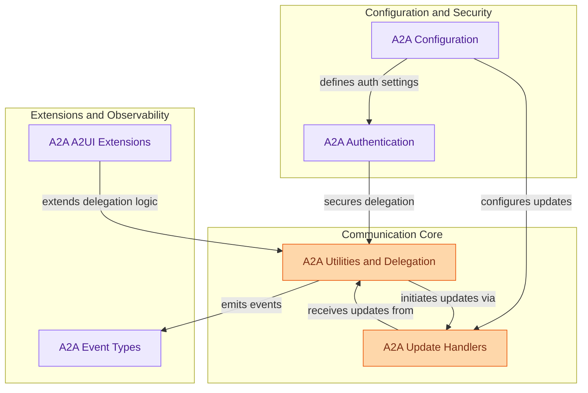

# Agent-to-Agent Communication
This module facilitates secure and robust communication between autonomous agents, handling authentication, configuration, various update mechanisms (polling, streaming, push notifications), and supporting extensions like A2UI for interactive interfaces, ensuring reliable inter-agent task delegation.

<!-- DIAGRAM_JSON
{
    "direction": "TD",
    "nodes": [
        {
            "id": "a2a_configuration",
            "label": "A2A Configuration",
            "type": "module",
            "link": "a2a_configuration.md"
        },
        {
            "id": "a2a_authentication",
            "label": "A2A Authentication",
            "type": "module",
            "link": "a2a_authentication.md"
        },
        {
            "id": "a2a_update_handlers",
            "label": "A2A Update Handlers",
            "type": "module",
            "link": "a2a_update_handlers.md"
        },
        {
            "id": "a2a_utils_and_delegation",
            "label": "A2A Utilities and Delegation",
            "type": "module",
            "link": "a2a_utils_and_delegation.md"
        },
        {
            "id": "a2a_extensions_a2ui",
            "label": "A2A A2UI Extensions",
            "type": "module",
            "link": "a2a_extensions_a2ui.md"
        },
        {
            "id": "a2a_event_types",
            "label": "A2A Event Types",
            "type": "module",
            "link": "a2a_event_types.md"
        }
    ],
    "edges": [
        {
            "source": "a2a_configuration",
            "target": "a2a_authentication",
            "label": "defines auth settings"
        },
        {
            "source": "a2a_configuration",
            "target": "a2a_update_handlers",
            "label": "configures updates"
        },
        {
            "source": "a2a_authentication",
            "target": "a2a_utils_and_delegation",
            "label": "secures delegation"
        },
        {
            "source": "a2a_update_handlers",
            "target": "a2a_utils_and_delegation",
            "label": "receives updates from"
        },
        {
            "source": "a2a_utils_and_delegation",
            "target": "a2a_update_handlers",
            "label": "initiates updates via"
        },
        {
            "source": "a2a_utils_and_delegation",
            "target": "a2a_event_types",
            "label": "emits events"
        },
        {
            "source": "a2a_extensions_a2ui",
            "target": "a2a_utils_and_delegation",
            "label": "extends delegation logic"
        }
    ],
    "groups": [
        {
            "id": "config_and_security",
            "label": "Configuration and Security",
            "role": "analytical",
            "nodes": [
                "a2a_configuration",
                "a2a_authentication"
            ]
        },
        {
            "id": "communication_core",
            "label": "Communication Core",
            "role": "generative",
            "nodes": [
                "a2a_update_handlers",
                "a2a_utils_and_delegation"
            ]
        },
        {
            "id": "extensions_and_observability",
            "label": "Extensions and Observability",
            "role": "analytical",
            "nodes": [
                "a2a_extensions_a2ui",
                "a2a_event_types"
            ]
        }
    ]
}
-->
