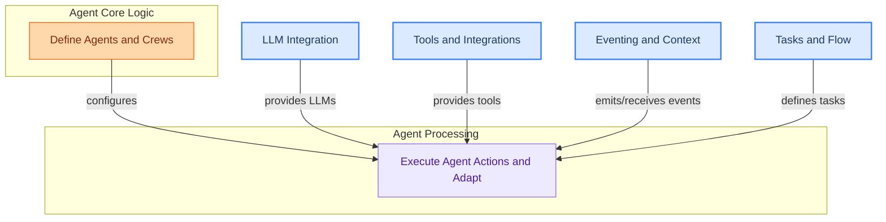

# Agents and Crews
This module defines the core components for creating and managing AI agents and crews. It includes structures for agent definition, lifecycle management, execution logic, and adapters for integrating with various LLM frameworks and structured output formats.

<!-- DIAGRAM_JSON
{
    "direction": "TD",
    "nodes": [
        {"id": "agent_definition", "label": "Define Agents and Crews", "type": "module", "link": "agent_definition.md"},
        {"id": "agent_execution_and_adapters", "label": "Execute Agent Actions and Adapt", "type": "module", "link": "agent_execution_and_adapters.md"},
        {"id": "llm_integration", "label": "LLM Integration", "type": "module", "link": "llm_integration.md"},
        {"id": "tools_and_integrations", "label": "Tools and Integrations", "type": "module", "link": "tools_and_integrations.md"},
        {"id": "eventing_and_context", "label": "Eventing and Context", "type": "module", "link": "eventing_and_context.md"},
        {"id": "tasks_and_flow", "label": "Tasks and Flow", "type": "module", "link": "tasks_and_flow.md"}
    ],
    "edges": [
        {"source": "agent_definition", "target": "agent_execution_and_adapters", "label": "configures"},
        {"source": "llm_integration", "target": "agent_execution_and_adapters", "label": "provides LLMs"},
        {"source": "tools_and_integrations", "target": "agent_execution_and_adapters", "label": "provides tools"},
        {"source": "eventing_and_context", "target": "agent_execution_and_adapters", "label": "emits/receives events"},
        {"source": "tasks_and_flow", "target": "agent_execution_and_adapters", "label": "defines tasks"}
    ],
    "groups": [
        {"id": "agent_core_logic", "label": "Agent Core Logic", "role": "generative", "nodes": ["agent_definition"]},
        {"id": "agent_processing", "label": "Agent Processing", "role": "analytical", "nodes": ["agent_execution_and_adapters"]}
    ]
}
-->
