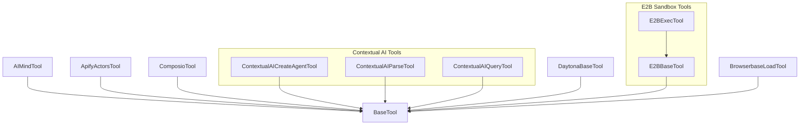

# ai_agent_and_execution
This module provides a collection of specialized tools for AI agents, enabling interaction with various external services and execution environments for enhanced capabilities.

<!-- DIAGRAM_JSON
{
    "nodes": [
        {
            "id": "AIMindTool",
            "label": "AIMindTool"
        },
        {
            "id": "ApifyActorsTool",
            "label": "ApifyActorsTool"
        },
        {
            "id": "ComposioTool",
            "label": "ComposioTool"
        },
        {
            "id": "ContextualAICreateAgentTool",
            "label": "ContextualAICreateAgentTool"
        },
        {
            "id": "ContextualAIParseTool",
            "label": "ContextualAIParseTool"
        },
        {
            "id": "ContextualAIQueryTool",
            "label": "ContextualAIQueryTool"
        },
        {
            "id": "DaytonaBaseTool",
            "label": "DaytonaBaseTool"
        },
        {
            "id": "E2BBaseTool",
            "label": "E2BBaseTool"
        },
        {
            "id": "E2BExecTool",
            "label": "E2BExecTool"
        },
        {
            "id": "BrowserbaseLoadTool",
            "label": "BrowserbaseLoadTool"
        },
        {
            "id": "BaseTool",
            "label": "BaseTool"
        }
    ],
    "edges": [
        {
            "source": "AIMindTool",
            "target": "BaseTool",
            "label": "inherits"
        },
        {
            "source": "ApifyActorsTool",
            "target": "BaseTool",
            "label": "inherits"
        },
        {
            "source": "ComposioTool",
            "target": "BaseTool",
            "label": "inherits"
        },
        {
            "source": "ContextualAICreateAgentTool",
            "target": "BaseTool",
            "label": "inherits"
        },
        {
            "source": "ContextualAIParseTool",
            "target": "BaseTool",
            "label": "inherits"
        },
        {
            "source": "ContextualAIQueryTool",
            "target": "BaseTool",
            "label": "inherits"
        },
        {
            "source": "DaytonaBaseTool",
            "target": "BaseTool",
            "label": "inherits"
        },
        {
            "source": "E2BBaseTool",
            "target": "BaseTool",
            "label": "inherits"
        },
        {
            "source": "E2BExecTool",
            "target": "E2BBaseTool",
            "label": "inherits"
        },
        {
            "source": "BrowserbaseLoadTool",
            "target": "BaseTool",
            "label": "inherits"
        }
    ],
    "groups": [
        {
            "id": "ContextualAITools",
            "label": "Contextual AI Tools",
            "nodes": [
                "ContextualAICreateAgentTool",
                "ContextualAIParseTool",
                "ContextualAIQueryTool"
            ]
        },
        {
            "id": "E2BSandboxTools",
            "label": "E2B Sandbox Tools",
            "nodes": [
                "E2BBaseTool",
                "E2BExecTool"
            ]
        }
    ]
}
-->
